<div class="cover">

# Bloc I - Collecter, transformer et sécuriser des données

## Pipeline data pour la supervision de la chaîne du froid pharmaceutique

**Dossier technique anonymisé**  
**Contexte : organisation pharmaceutique anonymisée / logistique de produits thermosensibles**  
**Objectif : collecter, stocker, transformer et sécuriser les données de température liées au transport et au stockage de lots pharmaceutiques**

</div>

---

## Sommaire

<div class="timeline-summary">
  <div class="timeline-item"><span>I</span><p>Introduction</p></div>
  <div class="timeline-item"><span>II</span><p>Contexte métier et données utiles</p></div>
  <div class="timeline-item"><span>III</span><p>Stratégie de collecte</p></div>
  <div class="timeline-item"><span>IV</span><p>Exemple concret de collecte</p></div>
  <div class="timeline-item"><span>V</span><p>Automatisation de la collecte</p></div>
  <div class="timeline-item"><span>VI</span><p>Stratégie de stockage et modèle de données</p></div>
  <div class="timeline-item"><span>VII</span><p>Construction de la base et stockage Big Data</p></div>
  <div class="timeline-item"><span>VIII</span><p>Technologies de traitement sélectionnées</p></div>
  <div class="timeline-item"><span>IX</span><p>Transformations des données</p></div>
  <div class="timeline-item"><span>X</span><p>Processus ETL et orchestration</p></div>
  <div class="timeline-item"><span>XI</span><p>Politique de sécurité des données</p></div>
  <div class="timeline-item"><span>XII</span><p>Architecture sécurisée</p></div>
  <div class="timeline-item"><span>XIII</span><p>Bilan critique</p></div>
  <div class="timeline-item"><span>XIV</span><p>Bibliographie</p></div>
  <div class="timeline-item"><span>XV</span><p>Lexique</p></div>
</div>

---

## I. Introduction

Mon dossier porte sur la chaîne du froid pharmaceutique, un périmètre qui mobilise directement les compétences du data engineering. Derrière des objets apparemment simples, comme des capteurs de température, des lots, des entrepôts ou des trajets de transport, se trouvent des enjeux structurants : ingestion en quasi temps réel, qualité de données, historisation, traçabilité, sécurité, contraintes réglementaires et exploitation par plusieurs métiers.

Le contexte est celui d'une organisation pharmaceutique anonymisée qui distribue des produits thermosensibles : vaccins, insulines, réactifs biologiques ou médicaments devant rester dans une plage de température définie. L'objectif n'est pas de prédire la demande ou de faire un modèle de machine learning. Le sujet est orienté *traçabilité* plutôt que _analyse ML_ qui permet de savoir si un lot a été correctement conservé, de retrouver les événements de température, et de produire une preuve technique en cas d'écart.

Ce périmètre permet également de mobiliser plusieurs briques techniques cohérentes avec une architecture data moderne : MQTT pour la couche terrain, Kafka pour centraliser et rejouer les événements, SQL pour la structuration, Airflow pour l'orchestration, dbt pour les transformations documentées et une architecture sécurisée pour maîtriser les accès aux données de qualité.

Le sujet est également cohérent avec les bonnes pratiques de distribution. L'EMA* définit la GDP* comme un ensemble de standards minimums permettant de maintenir la qualité et l'intégrité des médicaments dans la chaîne d'approvisionnement<sup>1</sup>. L'ANSM* insiste aussi sur la maîtrise de la chaîne du froid pour les produits thermosensibles<sup>2</sup>. Dès lors, lorsque la qualité d'un médicament dépend de ses conditions de conservation, les données de température deviennent une donnée métier critique.

---

## II. Contexte métier et données utiles

### a. Organisation étudiée

L'organisation étudiée est un laboratoire pharmaceutique anonymisé. Elle expédie des lots depuis un site de production vers plusieurs entrepôts régionaux, puis vers des hôpitaux, pharmacies ou grossistes répartiteurs. Certains produits doivent rester dans une plage de température stricte, par exemple entre +2°C et +8°C. L'ANSM rappelle ce type de contrainte dans ses recommandations sur la conservation des médicaments, notamment pour les produits à conserver entre +2 et +8°C<sup>3</sup>.

Dans ce contexte, le laboratoire a déjà plusieurs systèmes :

- un ERP qui contient les lots, produits, clients et commandes ;
- un WMS qui suit les entrées/sorties d'entrepôt ;
- des capteurs de température et d'humidité dans les chambres froides ;
- des capteurs embarqués dans les véhicules ou colis ;
- des transporteurs qui exposent parfois des API de suivi ;
- des fichiers de contrôle qualité produits par les équipes terrain.

Le problème n'est donc pas de trouver une donnée unique. Le problème est de relier correctement toutes ces données en assurant sa traçabilité.

### b. Problématique

La question métier est la suivante :

> Comment construire une chaîne de données fiable permettant de suivre la température des lots pharmaceutiques, de détecter les excursions, et de conserver une preuve exploitable pour les équipes qualité ?

Une excursion de température correspond ici à un passage en dehors de la plage attendue. Elle ne signifie pas automatiquement que le produit est inutilisable, mais elle déclenche une investigation qualité. Ce point est important : le pipeline data ne décide pas tout seul du sort du lot. Il remonte une information fiable, horodatée, vérifiable.

### c. Données utiles


| Famille de données   | Exemple                                   | Utilité                 | Sensibilité           | Destination                  |
| ----------------------- | ------------------------------------------- | -------------------------- | ------------------------ | ------------------------------ |
| Mesures capteurs      | température, humidité, batterie         | Suivre la conservation   | Critique qualité      | TimescaleDB / PostgreSQL     |
| Lots pharmaceutiques  | numéro de lot, produit, date expiration  | Relier mesure et produit | Sensible industriel    | PostgreSQL                   |
| Référentiel produit | plage de température, seuils, famille    | Contrôler les écarts   | Sensible métier       | PostgreSQL                   |
| Transport             | véhicule, position, transporteur, statut | Contextualiser l'écart  | Sensible opérationnel | PostgreSQL + stockage brut   |
| Événements qualité | alerte, investigation, décision          | Suivi métier            | Très sensible         | PostgreSQL                   |
| Logs pipeline         | exécution, erreurs, délais              | Audit technique          | Interne                | Table technique              |
| Données météo      | température extérieure                  | Enrichir l'analyse       | Publique               | Table d'enrichissement       |
| Références réglementaires validées | alertes, rappels, notes qualité | Veille qualité transmise par le service juridique / affaires réglementaires | Publique ou interne | Stockage documentaire + table veille |

Le périmètre est volontairement limité et ne comprend pas de données patient. Les données personnelles potentielles concernent surtout les comptes utilisateurs, les logs d'accès ou, selon les cas, les chauffeurs lorsque les trajets sont trop détaillés. Ces données doivent donc être minimisées.

---

## III. Stratégie de collecte

### a. Sources de données

La stratégie de collecte repose sur quatre familles de sources.

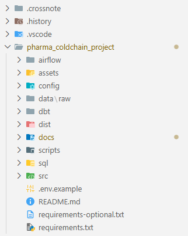

La première source est le flux des capteurs IoT. Les capteurs publient des messages toutes les 30 secondes ou toutes les minutes sur un broker MQTT. Chaque message contient l'identifiant du capteur, l'identifiant du lot ou du colis, l'horodatage, la température, l'humidité, le niveau de batterie et parfois une position GPS.

La deuxième source est la base métier. Elle contient les lots, les produits, les seuils attendus et les sites logistiques. Cette source est interrogée en SQL, car elle est structurée et stable.

La troisième source correspond aux API externes. On peut récupérer le statut transporteur, la position d'un véhicule, ou la météo extérieure sur une zone de livraison. La météo n'est pas obligatoire, mais elle aide à expliquer certains écarts : un camion bloqué en plein été n'a pas le même risque qu'un camion immobilisé en hiver.

La quatrième source est un référentiel documentaire de veille réglementaire. Dans un contexte pharmaceutique, cette matière n'est pas collectée librement par scraping : elle est plutôt fournie ou validée par le service juridique, les affaires réglementaires et les équipes qualité. Le rôle du pipeline data est alors d'intégrer ces références validées, de les historiser et de les relier au contexte qualité, sans se substituer à l'interprétation juridique ou réglementaire.

### b. Objectifs de collecte

La collecte vise quatre objectifs :

- suivre la température des lots en quasi temps réel ;
- conserver l'historique brut des mesures ;
- relier chaque mesure à un lot et à une plage de conformité ;
- produire une preuve exploitable en cas d'écart.

La qualité de collecte se joue sur trois points : exhaustivité, exactitude et conformité. L'exhaustivité veut dire que le pipeline doit détecter les trous de mesure. L'exactitude veut dire qu'une température doit être reliée au bon capteur, au bon lot et au bon horodatage. La conformité veut dire que l'on ne collecte pas plus que nécessaire.

### c. Schéma global de collecte

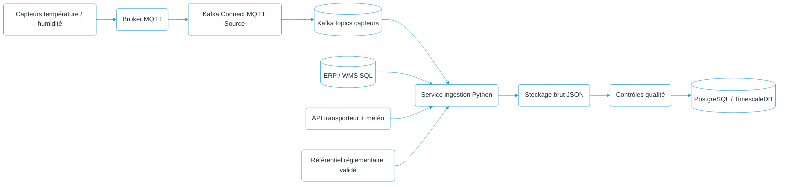

Ce schéma met en évidence un choix d'architecture important : les données ne sont pas chargées directement dans une table finale. MQTT reste au contact des capteurs, puis Kafka Connect fait entrer les messages dans Kafka<sup>5</sup>. Kafka joue le rôle de journal événementiel : il permet de rejouer les messages, d'alimenter plusieurs consommateurs et d'éviter qu'un seul traitement bloque toute la chaîne. Une zone brute est ensuite conservée afin de pouvoir revenir à l'événement d'origine. Cette étape supplémentaire augmente légèrement la complexité, mais elle renforce la traçabilité.

---

## IV. Exemple concret de collecte

### a. Message MQTT d'un capteur

Un capteur situé sur le quai d'expédition froid du site 042 publie un message JSON comme celui-ci :

```json
{
  "sensor_id": "SENSOR_06",
  "site_id": "042",
  "room_id": "QF-002",
  "zone": "Quai expédition froid",
  "batch_id": "LOT-INS-2026-0018",
  "timestamp": "2026-07-01T18:06:37Z",
  "temperature_c": 3.98,
  "humidity_pct": 66.7,
  "latitude": 45.70518,
  "longitude": 4.88772,
  "battery_pct": 87
}
```

Ce message est petit, mais il contient déjà beaucoup de choses : la mesure, le lien avec le lot, le temps, la zone opérationnelle et l'état du capteur. Le pipeline doit surtout éviter de perdre le contexte.

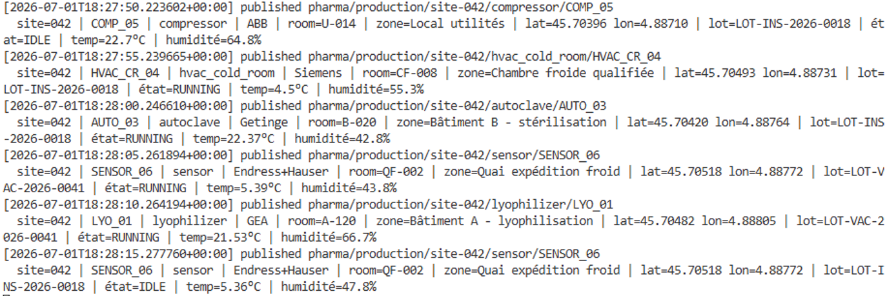

### b. Service d'ingestion MQTT

```python
import json
import paho.mqtt.client as mqtt

TOPIC = "pharma/production/site-042/#"

def on_message(client, userdata, msg):
    payload = json.loads(msg.payload.decode("utf-8"))
    event = {
        "topic": msg.topic,
        "sensor_id": payload["sensor_id"],
        "site_id": payload["site_id"],
        "room_id": payload["room_id"],
        "zone": payload["zone"],
        "batch_id": payload["batch_id"],
        "timestamp": payload["timestamp"],
        "temperature_c": float(payload["temperature_c"]),
        "humidity_pct": payload.get("humidity_pct"),
        "latitude": payload.get("latitude"),
        "longitude": payload.get("longitude"),
        "battery_pct": payload.get("battery_pct"),
        "raw_payload": payload,
    }
    write_raw_event(event)

client = mqtt.Client()
client.on_message = on_message
client.connect("mqtt-recette-01", 1883)
client.subscribe(TOPIC, qos=1)
client.loop_forever()
```

Le `qos=1` est retenu afin de privilégier la réception des mesures critiques, quitte à recevoir ponctuellement des doublons. Ces doublons sont ensuite traités par le hash d'événement et par les contraintes en base.

Dans une architecture industrialisée, cette lecture directe peut être remplacée ou complétée par Kafka Connect MQTT Source. Le rôle fonctionnel reste le même : transformer un message terrain en événement exploitable, historisable et distribuable à plusieurs traitements.

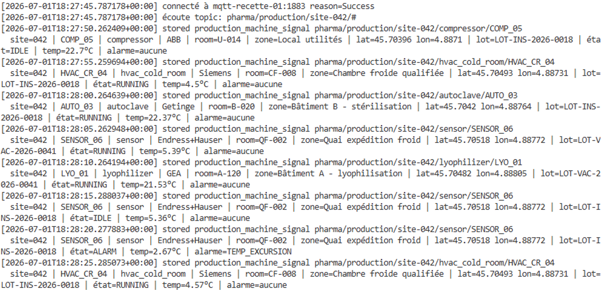

### c. Requête SQL de référentiel

```sql
SELECT
    b.batch_id,
    b.product_code,
    p.product_name,
    p.temp_min_c,
    p.temp_max_c,
    b.expiry_date
FROM quality.batch b
JOIN quality.product p ON p.product_code = b.product_code
WHERE b.status = 'IN_TRANSIT';
```
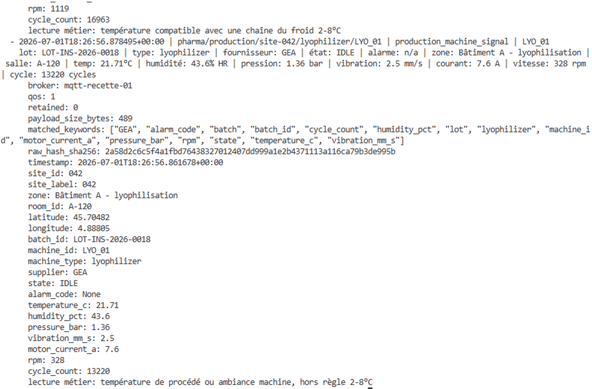
Cette requête sert à enrichir les mesures capteurs. Une température seule ne suffit pas : 6°C peut être conforme pour un produit entre 2°C et 8°C, mais non conforme pour un autre produit plus sensible.

### d. Collecte API et référentiel documentaire

Une API transporteur peut être interrogée pour récupérer le statut logistique :

```python
import requests

def get_shipment_status(shipment_id, token):
    url = f"https://api.transporteur.example/v1/shipments/{shipment_id}"
    response = requests.get(url, headers={"Authorization": f"Bearer {token}"}, timeout=20)
    response.raise_for_status()
    return response.json()
```

Pour la veille réglementaire, je ne retiens pas le crawling comme mécanisme principal. Le besoin est plutôt top-down : le service juridique, les affaires réglementaires ou les équipes qualité transmettent les références à suivre, puis le pipeline les intègre comme données documentaires validées. Cette approche évite de confondre collecte technique et interprétation réglementaire. Elle montre aussi qu'un pipeline data ne doit pas absorber tout ce qu'il peut trouver : il doit intégrer ce qui est utile, autorisé et gouverné, en lien avec le RGPD.

La collecte externe a été validée avec l'API Open-Meteo, utilisée comme donnée de contexte lors de l'analyse d'une excursion thermique. Le 7 septembre 2026, la requête a renvoyé une observation horodatée pour le périmètre `site_id = 042`. La réponse JSON brute a été conservée avant toute transformation, avec l'URL effectivement appelée et l'empreinte SHA-256 `1b0f45aa82e0d186c340ad1fcadf38cf7b2ca6f03ff2616f17cf4cd5794c6878`. Son chargement idempotent a créé une ligne dans `raw.open_meteo_snapshot` : température `29,8 °C`, humidité relative `44 %`, heure observée `2026-09-07 10:15 UTC`. La documentation officielle de l'API est citée en bibliographie<sup>6</sup>.

<figure>
  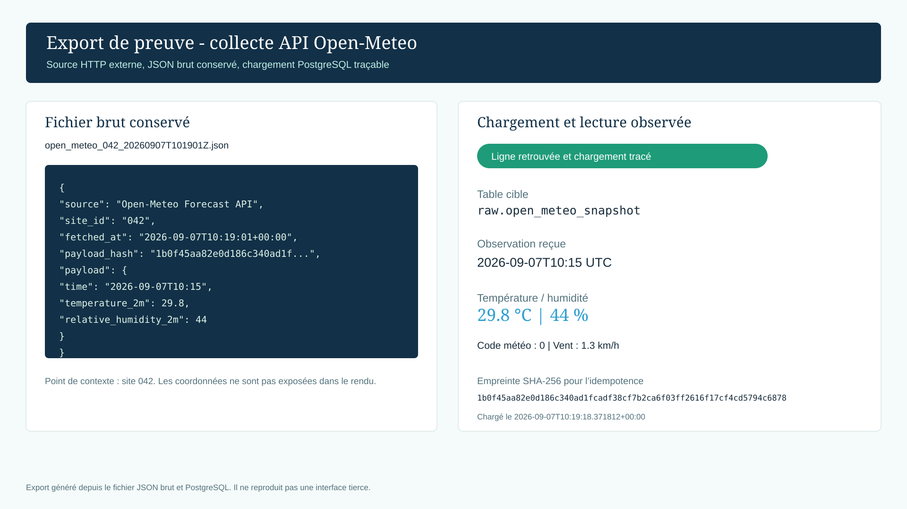
  <figcaption>Export de preuve de la collecte Open-Meteo : réponse JSON brute conservée puis retrouvée dans la zone <code>raw</code>. Les coordonnées du site ne sont pas affichées.</figcaption>
</figure>

### e. Contrôles qualité dès la collecte


| Critère      | Contrôle                                                                              |
| --------------- | ---------------------------------------------------------------------------------------- |
| Exhaustivité | Détecter les capteurs silencieux depuis plus de 5 minutes                             |
| Exactitude    | Vérifier que`batch_id` existe dans la base lot                                        |
| Cohérence    | Refuser une température impossible, par exemple -80°C sur un capteur standard 2-8°C |
| Intégrité   | Calculer un hash de l'événement brut                                                 |
| Conformité   | Ne pas collecter de données chauffeur si elles ne sont pas utiles                     |

---

## V. Automatisation de la collecte

### a. Automatisation temps réel et batch

Le pipeline mélange deux rythmes.

Le flux MQTT est continu : les capteurs publient leurs mesures pendant le transport ou dans les chambres froides. Kafka Connect récupère ces messages et les place dans des topics Kafka. Les consommateurs d'ingestion, de contrôle et d'alerte peuvent ensuite travailler sans dépendre directement du broker terrain.

Les autres traitements sont plutôt batch : synchronisation du référentiel produit, récupération météo, import des fichiers qualité et mise à jour du référentiel documentaire validé. Ces tâches peuvent être orchestrées par Airflow.

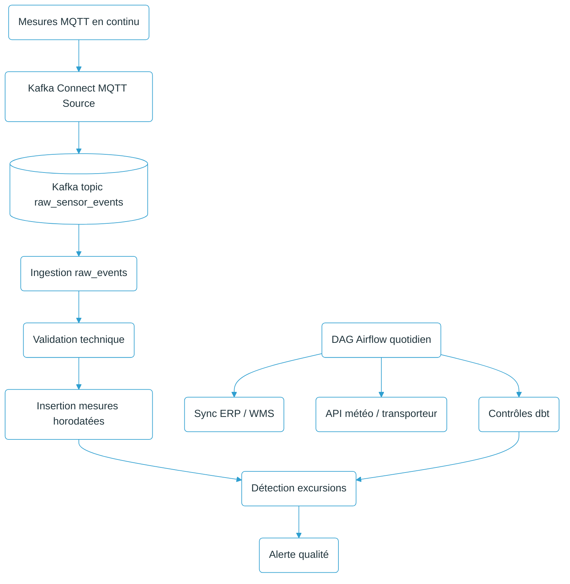

### b. Exemple de DAG Airflow

```python
from airflow import DAG
from airflow.operators.python import PythonOperator
from datetime import datetime, timedelta

with DAG(
    dag_id="cold_chain_daily_sync",
    start_date=datetime(2026, 1, 1),
    schedule_interval="0 2 * * *",
    catchup=False,
    default_args={"retries": 2, "retry_delay": timedelta(minutes=10)},
) as dag:

    sync_batches = PythonOperator(
        task_id="sync_batches_from_erp",
        python_callable=sync_batches_from_erp,
    )

    enrich_weather = PythonOperator(
        task_id="enrich_weather_data",
        python_callable=enrich_weather_data,
    )

    run_dbt = PythonOperator(
        task_id="run_dbt_quality_models",
        python_callable=run_dbt_models,
    )

    sync_batches >> enrich_weather >> run_dbt
```

Cette automatisation garantit que la donnée reste à jour. Elle donne aussi une visibilité claire : si la synchronisation ERP échoue, les étapes suivantes ne partent pas avec un référentiel obsolète.

---

## VI. Stratégie de stockage et modèle de données

### a. Stratégie de stockage

La stratégie de stockage est organisée en trois zones. Dans les architectures data lake / lakehouse, ce principe est souvent présenté sous la forme du modèle médaillon : ~~Bronze~~ cuivre !, Silver, Gold. Cette logique est retenue car elle décrit clairement la progression de la donnée, tout en conservant des noms opérationnels simples dans le projet : `raw`, `clean`, `curated`.


| Appellation médaillon | Nom dans le projet | Contenu                                                  | Rôle                      |
| --------------------- | -------------------- | ---------------------------------------------------------- | ---------------------------- |
| ~~Bronze~~ cuivre ! | `raw`              | événements Kafka/MQTT, réponses API, fichiers CSV qualité | Garder la trace brute      |
| Silver              | `clean`            | Mesures validées, lots enrichis, référentiels propres | Exploitation métier       |
| Gold                | `curated`          | Alertes, agrégats, indicateurs qualité                 | Reporting et investigation |

> **Note terminologique sur le mot ~~Bronze~~.** L'image des médailles est compréhensible, mais le terme peut être discuté dans un contexte data. La première couche d'un pipeline représente la donnée reçue, non corrigée et non encore valorisée. Le mot “cuivre” suggère déjà une forme de qualification, alors que le rôle de cette zone est de conserver le réel tel qu'il arrive, y compris lorsqu'il est incomplet, hétérogène ou difficile à exploiter. Le terme “cuivre” exprime mieux cette idée de point de départ : une matière moins noble, plus brute, mais indispensable pour construire les couches suivantes.

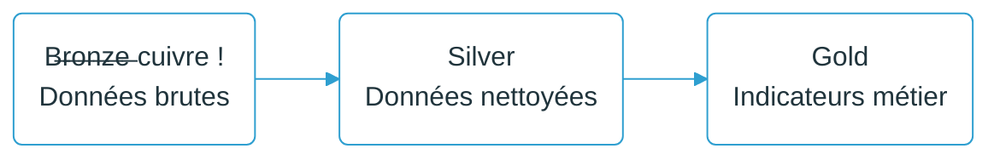

Le stockage à lieu sur un bucket S3 et un stockage **objet compatible** comme MinIO dans une version locale. Les données structurées sont stockées dans PostgreSQL avec une extension séries temporelles comme TimescaleDB. Ce choix limite la complexité initiale tout en restant compatible avec une montée en volume.

### b. Modèle de données

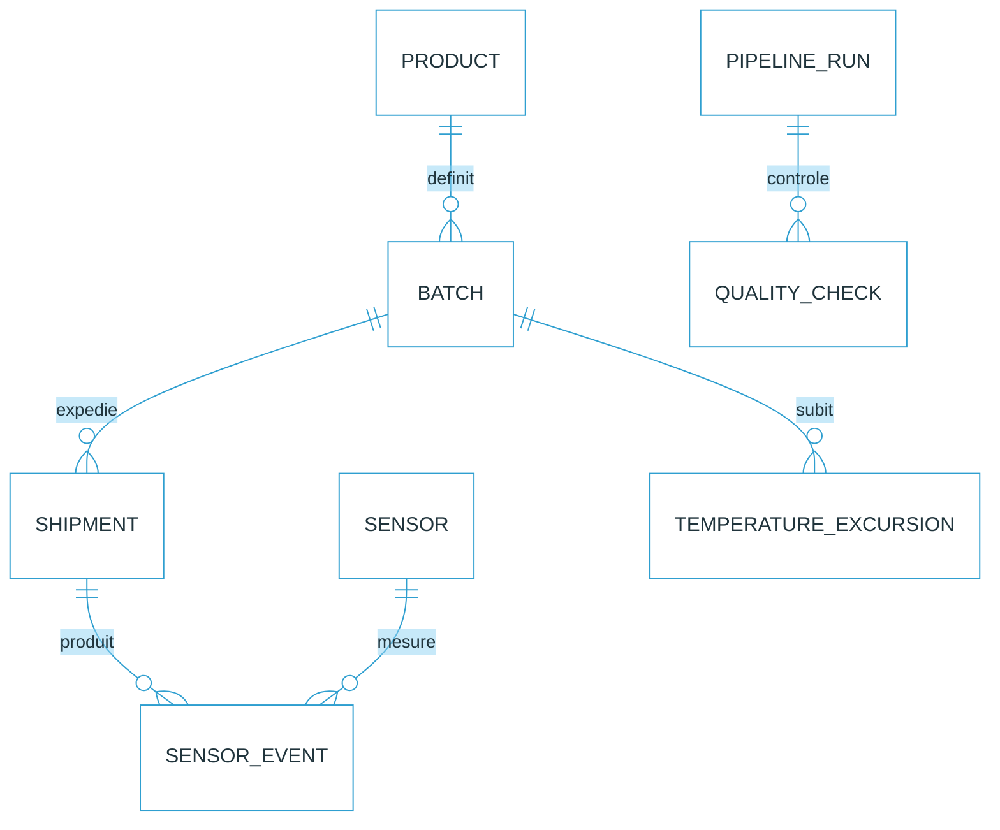

### c. Tables principales


| Table                   | Rôle                    | Champs clés                                           |
| ------------------------- | -------------------------- | -------------------------------------------------------- |
| `product`               | Référentiel produit    | `product_code`, `temp_min_c`, `temp_max_c`             |
| `batch`                 | Lots pharmaceutiques     | `batch_id`, `product_code`, `expiry_date`              |
| `shipment`              | Expéditions             | `shipment_id`, `batch_id`, `carrier`, `status`         |
| `sensor`                | Capteurs                 | `sensor_id`, `sensor_type`, `calibration_date`         |
| `sensor_event`          | Mesures horodatées      | `event_time`, `sensor_id`, `batch_id`, `temperature_c` |
| `temperature_excursion` | Écarts détectés       | `batch_id`, `start_time`, `end_time`, `severity`       |
| `pipeline_run`          | Exécutions pipeline     | `run_id`, `started_at`, `status`                       |
| `quality_check`         | Résultats de contrôles | `check_name`, `result`, `message`                      |

Ce modèle donne une place claire à chaque donnée. Il évite aussi de tout mettre dans une table unique, ce qui deviendrait vite illisible.

---

## VII. Construction de la base et stockage Big Data

### a. Extrait SQL

```sql
CREATE TABLE quality.product (
    product_code TEXT PRIMARY KEY,
    product_name TEXT NOT NULL,
    temp_min_c NUMERIC(5,2) NOT NULL,
    temp_max_c NUMERIC(5,2) NOT NULL,
    CHECK (temp_min_c < temp_max_c)
);

CREATE TABLE quality.batch (
    batch_id TEXT PRIMARY KEY,
    product_code TEXT NOT NULL REFERENCES quality.product(product_code),
    expiry_date DATE NOT NULL,
    status TEXT NOT NULL
);

CREATE TABLE quality.sensor_event (
    event_id UUID PRIMARY KEY DEFAULT gen_random_uuid(),
    event_time TIMESTAMPTZ NOT NULL,
    sensor_id TEXT NOT NULL,
    batch_id TEXT NOT NULL REFERENCES quality.batch(batch_id),
    temperature_c NUMERIC(5,2) NOT NULL,
    humidity_pct NUMERIC(5,2),
    battery_pct NUMERIC(5,2),
    raw_hash TEXT NOT NULL UNIQUE
);
```
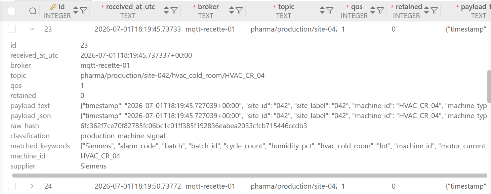
Le `raw_hash` sert à détecter les doublons, surtout avec MQTT en QoS 1. La clé étrangère vers `batch` garantit qu'une mesure n'est pas stockée sans lien avec un lot connu.

### b. Stockage brut

Le stockage objet garde les messages tels qu'ils sont arrivés. Une arborescence simple suffit :

```text
s3://pharma-coldchain-raw/
  mqtt/year=2026/month=06/day=29/hour=08/events.jsonl
  carrier_api/year=2026/month=06/day=29/status.json
  weather/year=2026/month=06/day=29/weather.json
  quality_files/year=2026/month=06/day=29/control_report.csv
```

Cette zone brute est importante. Si un calcul est contesté, on peut retrouver la mesure initiale.

### c. Solution Big Data

L'architecture ne repose pas directement sur Spark, Databricks ou Snowflake. Le choix retenu consiste à utiliser Kafka comme bus événementiel, tout en conservant une architecture lisible et maintenable pour l'auditabilité :

- Kafka pour centraliser les événements capteurs et permettre leur relecture ;
- stockage objet pour absorber le brut ;
- PostgreSQL / TimescaleDB pour les mesures et les relations métier ;
- dbt pour transformer les tables SQL ;
- possibilité d'exporter vers un data warehouse si le volume annuel devient trop important.

Cette solution répond au besoin Big Data parce qu'elle sépare le stockage brut volumineux du modèle relationnel exploitable.

MQTT est conservé pour la couche terrain, car il est léger et adapté aux capteurs. Kafka est retenu comme couche événementielle d’industrialisation, afin de centraliser les flux, permettre la relecture des événements, alimenter plusieurs consommateurs et fiabiliser les traitements temps réel.

---

## VIII. Technologies de traitement sélectionnées


| Technologie    | Rôle                   | Avantage                         | Limite                            | Choix          |
| ---------------- | ------------------------- | ---------------------------------- | ----------------------------------- | ---------------- |
| MQTT           | Collecte capteurs       | Léger, adapté IoT              | Nécessite gestion des doublons   | Retenu         |
| Python         | Ingestion et contrôles | Simple, beaucoup de librairies   | À encadrer par tests et logs      | Retenu         |
| PostgreSQL     | Données métier        | Intégrité, SQL, contraintes    | Moins adapté au brut massif      | Retenu         |
| TimescaleDB    | Séries temporelles     | Agrégats temporels efficaces    | Extension à maintenir            | Option retenue |
| Stockage objet | Zone brute              | Historique, coûts, scalabilité | Gouvernance nécessaire           | Retenu         |
| Airflow        | Orchestration batch     | Relance, planning, visibilité   | Trop lourd pour une seule tâche  | Retenu         |
| dbt            | Transformations SQL     | Tests, documentation, lignage    | Ne traite pas les flux temps réel directement | Retenu         |
| Kafka          | Bus d'événements interne | Temps réel à fort volume, relecture, multi-consommateurs | Exploitation plus lourde | Retenu en cible |
| Grafana        | Supervision             | Lisible pour exploitation        | Ne remplace pas les logs          | Optionnel      |

dbt a une place précise : il ne lit pas les capteurs et ne remplace pas Python. Il intervient après chargement SQL, pour produire des vues propres, documenter les règles, tester les champs obligatoires et construire les tables `curated`.

Kafka répond bien aux besoins de temps réel à grande échelle, surtout lorsqu'il faut absorber de gros volumes, rejouer des événements, alimenter plusieurs consommateurs et conserver un journal distribué. Il n'est pas placé au contact direct des capteurs : MQTT répond mieux à cette couche terrain avec des clients légers, des messages courts, une bonne tolérance aux contraintes réseau et un modèle publish/subscribe simple. Dans l'architecture cible, le lien entre les deux mondes est assuré par Kafka Connect MQTT Source : `MQTT -> Kafka Connect -> Kafka -> consommateurs qualité, monitoring, stockage brut, PostgreSQL/TimescaleDB`.

---

## IX. Transformations des données

### a. Transformations appliquées

Les transformations principales sont :

- normalisation des horodatages en UTC ;
- conversion des unités de température si nécessaire ;
- déduplication par hash ;
- rattachement mesure -> capteur -> lot -> produit ;
- contrôle de plage de température ;
- détection des excursions ;
- agrégation par lot, trajet et entrepôt ;
- génération d'indicateurs qualité.

### b. Exemple de détection d'excursion

```python
def classify_temperature(row):
    temp = row["temperature_c"]
    min_c = row["temp_min_c"]
    max_c = row["temp_max_c"]

    if temp < min_c:
        return "TOO_COLD"
    if temp > max_c:
        return "TOO_HOT"
    return "OK"
```

Ce code présente une règle volontairement minimale. Dans une version plus avancée, la classification devrait intégrer la durée de l'écart, le type de produit et les règles qualité internes.

### c. Modèle dbt

```sql
-- models/curated/int_temperature_status.sql
SELECT
    e.event_time,
    e.sensor_id,
    e.batch_id,
    b.product_code,
    e.temperature_c,
    p.temp_min_c,
    p.temp_max_c,
    CASE
        WHEN e.temperature_c < p.temp_min_c THEN 'TOO_COLD'
        WHEN e.temperature_c > p.temp_max_c THEN 'TOO_HOT'
        ELSE 'OK'
    END AS temperature_status
FROM {{ ref('stg_sensor_event') }} e
JOIN {{ ref('stg_batch') }} b ON b.batch_id = e.batch_id
JOIN {{ ref('stg_product') }} p ON p.product_code = b.product_code
```

Le modèle dbt rend la transformation lisible, versionnable et contrôlable. La règle métier n'est pas enfouie dans un script isolé : elle est exprimée dans un modèle SQL, rattachée au référentiel produit et intégrable dans un cycle de tests.

### d. Résultat attendu


| batch_id          | product_code | event_time          | temperature_c | status  |
| ------------------- | -------------- | --------------------- | --------------- | --------- |
| LOT-INS-2026-0018 | INSULINE-X   | 2026-06-29 08:12:30 | 4.8           | OK      |
| LOT-INS-2026-0018 | INSULINE-X   | 2026-06-29 08:13:00 | 9.4           | TOO_HOT |

À partir de ce statut, le pipeline peut créer une alerte qualité. L'alerte ne remplace pas l'expertise métier, mais elle déclenche l'investigation.

---

## X. Processus ETL et orchestration

### a. Vue d'ensemble


| Phase     | Entrée                           | Traitement                          | Sortie                     |
| ----------- | ----------------------------------- | ------------------------------------- | ---------------------------- |
| Extract   | Kafka/MQTT, SQL ERP, API, fichiers, web | Collecte et stockage brut           | ~~Bronze~~ cuivre ! events |
| Transform | Raw events + référentiel        | Nettoyage, rattachement, contrôles | Tables clean               |
| Load      | Tables clean                      | Chargement SQL, agrégats dbt       | Tables curated             |

### b. Schéma ETL

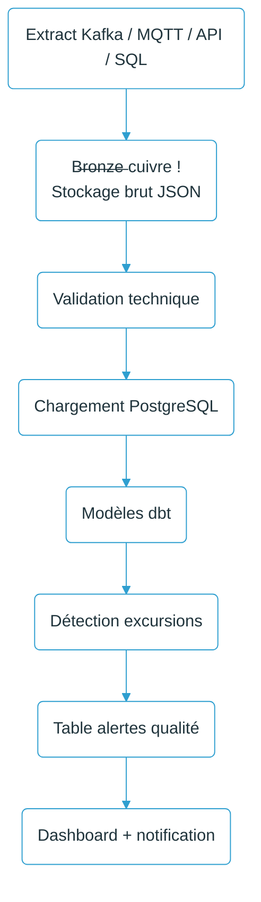

### c. Supervision

Les indicateurs suivis sont :


| Indicateur                            | Pourquoi                        |
| --------------------------------------- | --------------------------------- |
| Nombre de mesures reçues par capteur | Détecter les capteurs muets    |
| Latence ingestion                     | Vérifier le quasi temps réel  |
| Taux de messages rejetés             | Repérer un problème de format |
| Nombre d'excursions par lot           | Prioriser les investigations    |
| Durée moyenne d'excursion            | Mesurer la gravité             |
| Dernière exécution Airflow réussie | Garantir l'actualisation        |

Ces indicateurs restent volontairement opérationnels. L'objectif n'est pas de produire un tableau de bord décoratif, mais un support de supervision directement utile aux équipes qualité et data.

---

## XI. Politique de sécurité des données

### a. Classification

Toutes les données ne sont pas au même niveau.


| Niveau       | Données                                        | Mesures                              |
| -------------- | ------------------------------------------------- | -------------------------------------- |
| Public       | Références réglementaires publiques          | Stockage simple, citation source     |
| Interne      | Logs pipeline, météo enrichie                 | Accès équipe data                  |
| Confidentiel | Lots, produits, transporteurs, statuts qualité | RBAC*, chiffrement, audit             |
| Critique     | Décisions qualité, excursions sensibles       | Accès limité, journalisation forte |

Les données ne sont pas des données patient, mais elles restent sensibles. Un incident de chaîne du froid peut avoir un impact industriel, financier et sanitaire. Elles doivent donc être traitées avec un niveau de protection élevé.

### b. Mesures retenues

- chiffrement au repos du stockage objet et de PostgreSQL ;
- chiffrement en transit entre capteurs, broker et services internes ;
- séparation des rôles : data engineer, qualité, exploitation, admin ;
- gestion des secrets pour les API et mots de passe ;
- journalisation des accès aux tables critiques ;
- sauvegardes régulières ;
- environnement de qualification avec données anonymisées ;
- conservation limitée des données inutiles.

### c. Matrice des accès


| Rôle                   | Mesures capteurs            | Lots             | Alertes qualité   | Administration |
| ------------------------- | ----------------------------- | ------------------ | -------------------- | ---------------- |
| Data engineer           | Lecture/écriture technique | Lecture          | Lecture            | Non            |
| Responsable qualité    | Lecture                     | Lecture          | Lecture/validation | Non            |
| Exploitation logistique | Lecture limitée            | Lecture limitée | Lecture            | Non            |
| Administrateur système | Maintenance                 | Non fonctionnel  | Non fonctionnel    | Oui            |
| Auditeur                | Lecture historisée         | Lecture          | Lecture            | Non            |

Le point important est que l'administrateur technique ne doit pas automatiquement avoir un droit fonctionnel sur les décisions qualité.

---

## XII. Architecture sécurisée

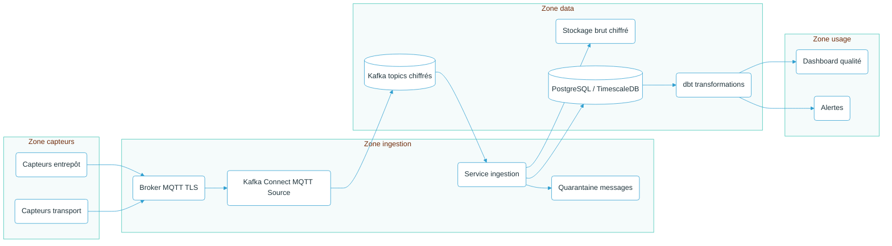

L'architecture sépare les zones. Les capteurs ne communiquent pas directement avec la base de données. Les utilisateurs ne consultent pas directement le stockage brut. Les flux passent par des services contrôlés, ce qui renforce la robustesse et la gouvernance technique.

### a. Flux principaux


| Flux                       | Contrôle                                  |
| ---------------------------- | -------------------------------------------- |
| Capteur -> MQTT            | TLS, identifiant capteur, topic contrôlé |
| MQTT -> Kafka Connect      | compte service, QoS, logs de connecteur   |
| Kafka Connect -> Kafka     | topics séparés, rétention, droits limités |
| Kafka -> ingestion         | consumer group, offset, reprise contrôlée |
| Ingestion -> stockage brut | chiffrement, hash                          |
| Ingestion -> PostgreSQL    | contraintes, transactions                  |
| PostgreSQL -> dbt          | compte technique limité                   |
| dbt -> dashboard           | vues filtrées, accès par rôle           |

---

## XIII. Bilan critique

Ce projet montre qu'une architecture data utile peut rester volontairement sobre. Dans cette chaîne du froid pharmaceutique, la valeur ne vient pas seulement d'algorithmes avancés : elle vient d'abord de la fiabilité de la collecte QA, de la traçabilité des événements et de la capacité à relier une mesure à un lot exploitable par les équipes qualité.

La première limite concerne le passage d'un cas d'étude anonymisé à une validation industrielle complète. En entreprise pharmaceutique, les règles doivent être validées avec les équipes qualité, les affaires réglementaires, la logistique et l'IT. Une excursion ne peut pas être qualifiée uniquement par le pipeline data : elle doit s'inscrire dans une procédure métier validée.

La deuxième limite concerne les capteurs. Une donnée capteur n'est pas automatiquement vraie. Il faut gérer l'étalonnage, les pannes, la batterie, les pertes de réseau, et parfois les valeurs aberrantes. Le pipeline doit donc garder les messages bruts et ne pas écraser trop vite ce qui semble étrange.

La troisième limite concerne la sécurité. Même sans données patient, les données qualité sont sensibles. Elles peuvent révéler des incidents, des faiblesses logistiques ou des informations commerciales. C'est pour cela que la sécurité est intégrée au dossier, pas ajoutée à la fin.

Au final, ce sujet couvre bien le Bloc 1 : stratégie de collecte, exemple de collecte, automatisation, stockage, base SQL, solution de stockage Big Data, outils de traitement, transformations, ETL, politique de sécurité et architecture sécurisée.

---

## XIV. Bibliographie

<sup>1</sup> European Medicines Agency, "Good distribution practice" : https://www.ema.europa.eu/en/human-regulatory-overview/post-authorisation/compliance-post-authorisation/good-distribution-practice
<sup>2</sup> ANSM, "Bonnes pratiques de distribution en gros" : https://ansm.sante.fr/documents/reference/bonnes-pratiques-de-distribution-en-gros
<sup>3</sup> ANSM, "Conservation des médicaments en cas de vague de chaleur" : https://ansm.sante.fr/uploads/2022/06/15/20220610-canicule-conservation-medicaments-juin2017-1.pdf
<sup>4</sup> WHO, "Model guidance for the storage and transport of time and temperature sensitive pharmaceutical products" : https://www.who.int/publications/m/item/trs961-annex9-modelguidanceforstoragetransport
<sup>5</sup> Lenses.io, "MQTT Source Connector" : https://docs.lenses.io/latest/connectors/kafka-connectors/sources/mqtt
<sup>6</sup> Open-Meteo, "Weather Forecast API" : https://open-meteo.com/en/docs

---

## XV. Lexique

| Terme | Définition |
| --- | --- |
| EMA | European Medicines Agency, agence européenne du médicament. |
| GDP | Good Distribution Practice : bonnes pratiques de distribution applicables à la chaîne d'approvisionnement des médicaments. |
| ANSM | Agence nationale de sécurité du médicament et des produits de santé. |
| RBAC | Role-Based Access Control : gestion des droits selon les rôles utilisateurs. |
| MQTT | Protocole publish/subscribe léger, souvent utilisé pour les capteurs et objets connectés. |
| Kafka | Plateforme de streaming d'événements utilisée pour centraliser, historiser et rejouer des flux de données. |
| Kafka Connect | Framework de connecteurs permettant d'intégrer Kafka avec d'autres systèmes, par exemple un broker MQTT, une base SQL ou un stockage objet. |
| QoS | Quality of Service : niveau de garantie de livraison d'un message MQTT. |
| TLS | Transport Layer Security : protocole de chiffrement des communications réseau. |
| ETL | Extract, Transform, Load : processus d'extraction, transformation et chargement des données. |
| dbt | Outil de transformation SQL utilisé pour documenter, tester et structurer les modèles de données. |
