<div class="cover">

# Bloc II - Analyser, organiser et valoriser des données

## Qualification analytique des excursions thermiques dans les zones fixes d'un site pharmaceutique

**Dossier technique anonymisé**  
**Contexte : organisation pharmaceutique anonymisée / supervision de zones sous température dirigée**  
**Objectif : transformer les événements collectés en indicateurs fiables, tester une première association observable et soutenir la décision qualité**

</div>

## Sommaire

<div class="timeline">
  <div class="timeline-item"><span>I</span><p>Introduction</p></div>
  <div class="timeline-item"><span>II</span><p>Analyse du besoin</p></div>
  <div class="timeline-item"><span>III</span><p>Plan d'analyse et métriques</p></div>
  <div class="timeline-item"><span>IV</span><p>Qualification initiale des données</p></div>
  <div class="timeline-item"><span>V</span><p>Préparation analytique</p></div>
  <div class="timeline-item"><span>VI</span><p>Requêtes et calculs</p></div>
  <div class="timeline-item"><span>VII</span><p>Tests statistiques</p></div>
  <div class="timeline-item"><span>VIII</span><p>Visualisation des résultats</p></div>
  <div class="timeline-item"><span>IX</span><p>Recommandations</p></div>
  <div class="timeline-item"><span>X</span><p>Accompagnement des utilisateurs</p></div>
  <div class="timeline-item"><span>XI</span><p>Documentation technique</p></div>
</div>

## I. Introduction

Après la collecte, les messages MQTT sont chargés dans PostgreSQL, qualifiés par
dbt, puis exploités dans un notebook et un dashboard. La donnée doit encore
prouver qu'elle signifie quelque chose avant de devenir un indicateur métier.

Une température de `21 °C` peut être normale pour une zone de production et
critique pour une chambre froide. Le pipeline peut être techniquement disponible
tout en donnant une lecture métier fausse si cette distinction n'est pas
intégrée.

L'étude est donc centrée sur les zones fixes sous température dirigée : chambres
froides, quais d'expédition et équipements frigorifiques associés. Les
températures de procédé des autoclaves, des lyophilisateurs ou des lignes de
remplissage restent conservées dans la base, mais elles ne sont pas comparées à
la règle `2-8 °C`.

La question qui guide le travail est la suivante :

> Comment transformer les événements collectés en indicateurs
> thermiques fiables, et que permet réellement d'établir la fenêtre disponible
> sur les différences entre les locaux observés ?

Sur la fenêtre disponible, `119` mesures sont éligibles à une règle thermique.
`117` sont conformes, soit `98,32 %`, et deux écarts sont observés dans le local
`CF-008`. Le test exact de Fisher ne met pas en évidence d'association
statistiquement significative entre le local et le statut thermique
(`p = 0,227`). Ce résultat qualifie la méthode et le pipeline ; il ne suffit pas
à comparer durablement les performances des locaux.

L'objectif n'est pas de laisser un indicateur décider du devenir d'un lot. Le
système d'analyse doit rendre une situation lisible, traçable et comparable,
afin que le responsable qualité puisse décider de l'investigation à conduire.

## II. Analyse du besoin

### a. Commanditaire et utilisateurs

Le commanditaire retenu est le responsable qualité et logistique. Il doit
pouvoir distinguer un écart ponctuel d'une excursion durable, identifier les
zones les plus exposées et retrouver les lots concernés. Les utilisateurs
secondaires sont les équipes logistiques, la maintenance frigorifique et
l'équipe data chargée de la disponibilité des indicateurs.

Les besoins ne sont pas identiques. La qualité cherche une preuve et une
sévérité. La logistique cherche le lieu et le moment où l'écart apparaît. La
maintenance cherche un signal associé à l'état de l'équipement. L'équipe data,
elle, doit savoir si l'absence d'un point correspond à une température stable ou
simplement à une donnée qui n'est jamais arrivée.

### b. Enjeux

L'enjeu principal est de réduire le temps nécessaire pour qualifier un événement
thermique sans produire de faux positifs. Une règle trop large augmente le
nombre d'alertes et finit par les rendre ordinaires. Une règle trop étroite peut
au contraire masquer un incident. La qualité de l'analyse dépend donc autant de
la définition des métriques que de la précision des capteurs.

Le second enjeu concerne la traçabilité. Chaque résultat présenté dans le
dashboard doit pouvoir être relié aux mesures sources, à la règle thermique
appliquée, à la zone et au lot lorsque cette relation existe. Cette capacité de
suivi s'inscrit dans le cadre général des bonnes pratiques de distribution des
médicaments, qui accordent une place importante à la maîtrise des conditions de
stockage et de transport.<sup>1</sup>

### c. Contraintes

| Contrainte | Conséquence sur l'analyse |
| --- | --- |
| Plusieurs types de températures | Les mesures de stockage et de procédé sont séparées |
| Série temporelle irrégulière | La couverture et les trous de mesure sont contrôlés |
| Données qualité sensibles | Le dashboard utilise des identifiants techniques et des accès limités |
| Décision métier humaine | Une alerte déclenche une investigation, elle ne libère ni ne rejette un lot |
| Historique initial court | Le test est exploratoire ; il ne permet pas de conclure à une relation causale |

## III. Plan d'analyse et métriques

### a. Axes d'analyse

L'analyse est organisée autour de cinq axes :

- vérifier la couverture, la fraîcheur et l'unicité des événements ;
- mesurer la conformité thermique par jour, zone et local ;
- regrouper les points successifs hors plage en épisodes d'excursion ;
- quantifier leur durée et leur sévérité ;
- relier les épisodes aux lots et, lorsque les données seront disponibles, aux
  ouvertures de porte, aux cycles frigorifiques et à la température extérieure.

Cette progression évite de commencer par un graphique séduisant dont le calcul
serait mal défini. La visualisation arrive après la qualification de la mesure,
pas avant.

### b. Indicateurs principaux

| Indicateur | Définition | Décision soutenue |
| --- | --- | --- |
| Taux de conformité thermique | Mesures éligibles dans la plage / mesures éligibles | Identifier les zones à investiguer |
| Exposition thermique cumulée | Écart à la borne multiplié par la durée | Comparer la sévérité des épisodes |
| Taux de lots exposés | Lots avec excursion confirmée / lots surveillés | Mesurer l'impact métier |

Ces trois indicateurs sont complétés par le nombre d'excursions, leur durée
médiane, leur durée maximale et le délai de disponibilité des données. Le taux
de couverture reste un garde-fou : une conformité de `100 %` n'a pas la même
valeur si la moitié des mesures attendues manque.

### c. Hypothèse testable sur la fenêtre actuelle

La première hypothèse est volontairement simple : le statut thermique est-il
associé au local observé ?

- `H0` : le statut conforme ou hors plage est indépendant du local ;
- `H1` : le statut conforme ou hors plage est associé au local ;
- seuil de décision : `α = 5 %`.

Ce test ne recherche pas encore une cause. Les variables d'ouverture de porte,
de consigne, d'état du groupe froid et de météo extérieure ne sont pas présentes
dans la fenêtre étudiée. Elles deviennent le plan d'enrichissement, pas des
explications inventées après coup.

## IV. Qualification initiale des données

### a. Périmètre contrôlé

La base brute contient `347` événements MQTT répartis entre six types
d'équipements. Ils ont été reçus les `1er` et `2 juillet 2026` en UTC, puis
chargés dans le socle analytique le `29 juillet 2026`. L'audit trouve `0`
empreinte dupliquée et `0` valeur manquante dans les champs indispensables. Sur
le plan technique, cette première matière est donc propre pour tester le
chargement et les transformations.

Sa couverture reste cependant courte : les événements sont concentrés sur deux
créneaux horaires actifs. La fraîcheur du chargement PostgreSQL ne doit donc pas
être confondue avec la récence des événements étudiés. Une capture est également
restée déclarée en cours dans les métadonnées alors que son processus n'est plus
actif. Cette anomalie ne modifie pas les mesures, mais elle montre que les
journaux d'exécution doivent être réconciliés avant de calculer un taux de
disponibilité.

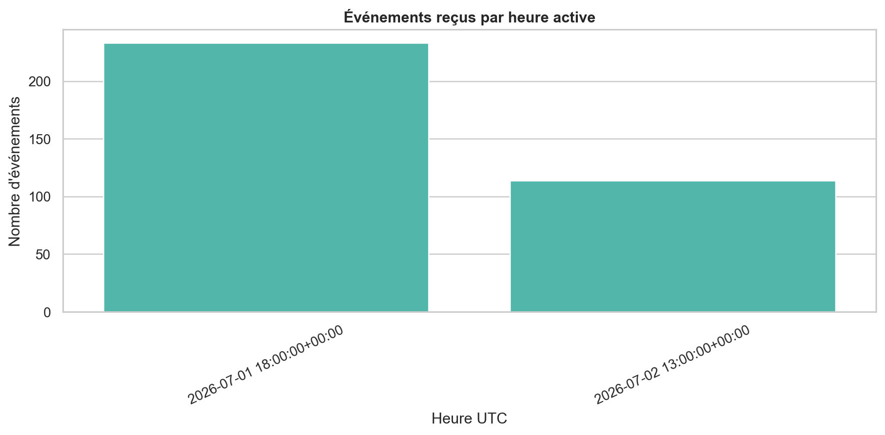

### b. Une erreur de règle qui change toute la lecture

Parmi les `347` événements, `119`, soit `34,3 %`, correspondent réellement au
stockage frigorifique ou au quai d'expédition. Si la règle `2-8 °C` est appliquée
uniformément à toutes les machines, `230` mesures sont déclarées hors plage. Ce
résultat paraît alarmant, mais il compare en réalité des températures qui n'ont
pas la même signification.

Après rapprochement avec le contexte de mesure, les températures des équipements
de procédé reçoivent le statut `NOT_APPLICABLE`. Les règles froides ne sont
appliquées qu'aux équipements `hvac_cold_room` et `sensor` associés aux zones
concernées.

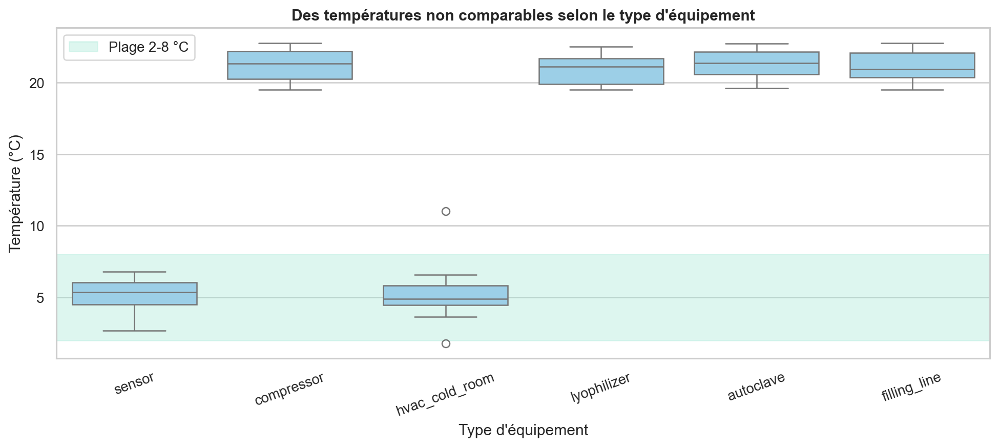

Ce graphique ne sert donc pas encore à conclure sur la performance thermique du
site. Il démontre quelque chose de plus fondamental : sans référentiel de règles,
une donnée exacte peut produire une analyse incorrecte.

### c. Décision de qualification

Le jeu actuel est retenu pour qualifier le pipeline analytique, les contrôles
dbt, le dashboard et l'exécution d'un premier test exploratoire. Il n'est pas
retenu pour attribuer une cause aux excursions. Une période couvrant plusieurs
semaines, plusieurs zones froides et des variables opérationnelles
supplémentaires reste nécessaire avant une comparaison métier robuste.

## V. Préparation analytique

### a. Chaîne de traitement

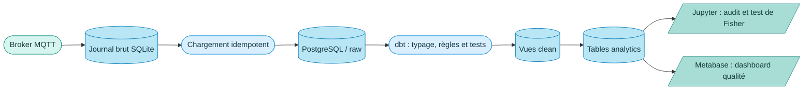

La chaîne représentée est celle qui a été exécutée. Le broker transporte les
événements, le journal brut garde une preuve locale, PostgreSQL structure la
matière et dbt transforme les tables jusqu'aux vues de décision. Le notebook et
Metabase lisent les mêmes modèles analytiques : un chiffre ne change donc pas de
définition selon l'outil qui l'affiche.

### b. Modèles produits

La donnée est organisée en trois niveaux. La dernière couche porte le nom
physique `analytics` dans PostgreSQL :

| Appellation logique | Nom physique au bloc II | Contenu |
| --- | --- | --- |
| ~~Bronze~~ cuivre ! | journal SQLite et schéma `raw` | Événements reçus sans réécriture métier |
| Silver | schéma `clean` | Événements typés et rapprochés des règles |
| Gold / `curated` | schéma `analytics` | Faits, excursions et marts de décision |

Le terme `analytics` ne crée donc pas une quatrième couche. Il désigne
l'implémentation physique de la couche `curated`.

| Modèle | Rôle |
| --- | --- |
| `stg_sensor_events` | Typage des événements et normalisation des états |
| `int_temperature_status` | Application de la règle correspondant au contexte |
| `fct_sensor_reading` | Conservation des mesures qualifiées |
| `fct_temperature_excursion` | Regroupement des points hors plage en épisodes |
| `mart_quality_daily` | Indicateurs journaliers par zone et local |
| `mart_batch_traceability` | Synthèse des excursions confirmées par lot |

Les deux tables de faits gardent des grains distincts : une ligne par mesure
qualifiée dans `fct_sensor_reading`, puis une ligne par épisode regroupé dans
`fct_temperature_excursion`.

<div class="figure-pair figure-pair-facts">
  <figure>
    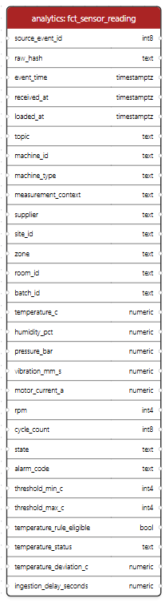
    <figcaption>Table de faits des mesures qualifiées.</figcaption>
  </figure>
  <figure>
    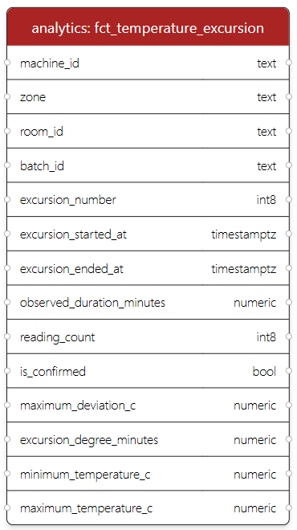
    <figcaption>Table de faits des excursions thermiques.</figcaption>
  </figure>
</div>

Le chargement est idempotent grâce à l'empreinte `raw_hash`. Une nouvelle
exécution ne duplique donc pas les `347` événements déjà présents. Les tests dbt
contrôlent notamment l'unicité, les valeurs obligatoires, les états autorisés et
les statuts thermiques possibles. Les tests de données dbt fonctionnent comme
des assertions exécutées sur les modèles et renvoient les lignes qui invalident
la règle contrôlée.<sup>2</sup>

<figure class="page-break-before">
  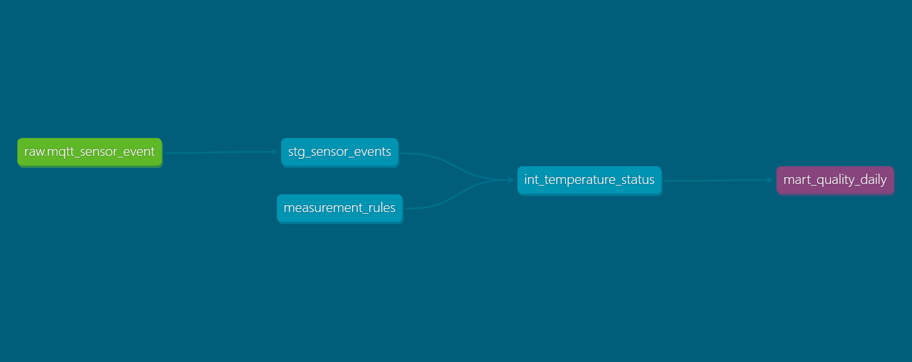
  <figcaption>Dépendances dbt conduisant au mart qualité journalier.</figcaption>
</figure>

Le graphe de dépendances montre que le mart journalier n'est pas alimenté
directement depuis le message MQTT. Il dépend d'abord du staging, puis du
rapprochement avec le référentiel de règles. Cette étape intermédiaire est ce qui
empêche une température de procédé d'être classée à tort comme excursion de
stockage.

### c. Évolutivité du pipeline

Kafka devient pertinent lorsque le débit, le besoin de rejeu ou le nombre de
consommateurs augmente. Airflow peut prendre en charge la planification, les
relances et l'historique des traitements. Sur la fenêtre actuelle, le journal
brut et le script d'exécution suffisent à reproduire l'analyse.

## VI. Requêtes et résultats analytiques

### a. Calcul du taux de conformité

Le dénominateur ne contient que les mesures déclarées éligibles par le
référentiel. Le calcul journalier est réalisé dans PostgreSQL après
transformation dbt :

```sql
SELECT
    observation_date,
    room_id,
    eligible_reading_count,
    compliant_reading_count,
    temperature_compliance_rate_pct
FROM analytics.mart_quality_daily
ORDER BY observation_date, room_id;
```

| Local | Mesures éligibles | Conformes | Hors plage | Conformité |
| --- | ---: | ---: | ---: | ---: |
| `CF-008` | 57 | 55 | 2 | 96,49 % |
| `QF-002` | 62 | 62 | 0 | 100,00 % |
| **Ensemble** | **119** | **117** | **2** | **98,32 %** |

<figure class="figure-compact">
  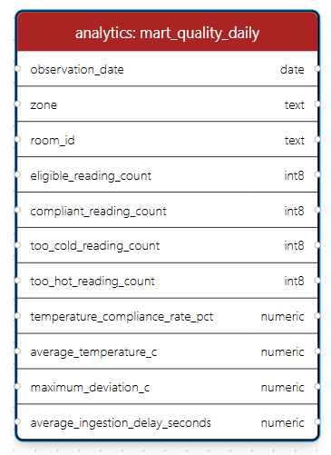
  <figcaption>Structure du mart utilisé pour calculer les indicateurs quotidiens.</figcaption>
</figure>

Le résultat global est élevé, mais le volume est encore trop court pour parler
de tendance. Les deux écarts se trouvent dans `CF-008` : une mesure à `1,80 °C`
et une à `11,01 °C`.

### b. Lecture des enregistrements qualifiés

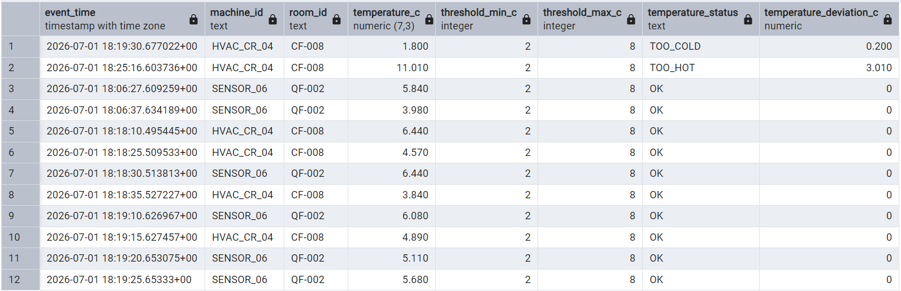

La vue expose simultanément la mesure, le contexte, les seuils applicables, le
statut et l'écart calculé. Les lignes hors plage sont triées en premier pour
faciliter l'investigation. Cette présentation n'est pas le dashboard final ;
elle constitue une preuve de contrôle entre la donnée transformée et son rendu.

### c. Traçabilité des excursions

Les deux mesures hors plage portent le code `TEMP_EXCURSION`. Elles sont donc
conservées comme épisodes confirmés même si chacune ne contient qu'un point. La
durée observée vaut alors zéro minute : cela signifie que la série disponible ne
permet pas de mesurer la durée, pas que l'écart a été instantané. Cette nuance
est importante, car une ligne seule ne doit pas devenir artificiellement un
épisode de plusieurs minutes.

Le lot, le local, l'équipement, l'horodatage et l'empreinte source permettent de
remonter du dashboard jusqu'au message reçu. Le pipeline apporte une piste
d'audit, mais la décision qualité reste séparée du calcul automatique.

<figure class="figure-compact">
  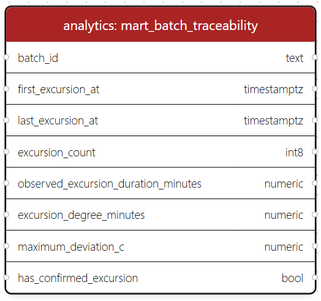
  <figcaption>Structure du mart de traçabilité des excursions par lot.</figcaption>
</figure>

## VII. Test statistique

### a. Choix du test

Le tableau croise deux locaux et deux statuts. Une seule observation hors plage
supplémentaire ferait fortement varier les pourcentages, et une cellule vaut
zéro. Le test exact de Fisher est adapté aux tableaux de contingence `2 x 2` et
évite de s'appuyer sur une approximation asymptotique fragile dans cette
situation.<sup>3</sup>

```python
table = [[2, 55], [0, 62]]  # hors plage, conforme
resultat = fisher_exact(table, alternative="two-sided")
alpha = 0.05
decision = "rejet de H0" if resultat.pvalue < alpha else "H0 non rejetée"
```

### b. Résultat

| Élément | Valeur |
| --- | ---: |
| Taux hors plage `CF-008` | 3,51 % |
| Taux hors plage `QF-002` | 0,00 % |
| Écart descriptif | 3,51 points |
| p-value bilatérale | 0,227 |
| Seuil α | 0,050 |
| Décision | `H0` non rejetée |

L'odds ratio exact est infini parce que la cellule « hors plage dans `QF-002` »
vaut zéro. Cette valeur n'indique pas un risque infini ; elle indique surtout que
l'estimation de l'effet est instable sur un tableau aussi peu rempli.

### c. Interprétation et limites

La p-value est supérieure au seuil de 5 %. Je ne mets donc pas en évidence
d'association statistiquement significative entre le local et le statut
thermique sur cette fenêtre. Je ne peux pas conclure pour autant que les locaux
sont équivalents. « Ne pas rejeter `H0` » et « démontrer l'absence de différence »
sont deux propositions différentes.

La robustesse est limitée par quatre points : deux écarts seulement, deux jours
de calendrier, des mesures successives issues des mêmes capteurs et l'absence de
variables explicatives. Le prochain test devra être réalisé sur des épisodes
indépendants plutôt que sur chaque point brut, afin de ne pas gonfler
artificiellement la taille de l'échantillon.

## VIII. Visualisation des résultats

### a. Contrôle visuel des seuils

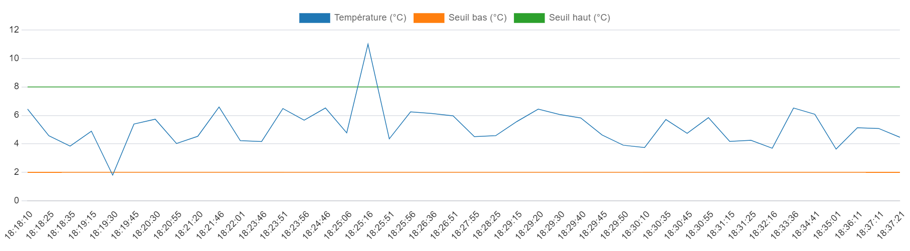

La courbe superpose la température observée aux bornes `2 °C` et `8 °C`. Elle
permet de repérer immédiatement les deux sorties de plage et de vérifier que les
valeurs conformes restent entre les seuils. Le graphique complète la table : il
montre la forme temporelle, tandis que la table conserve les valeurs exactes.

### b. Comparaison par périmètre

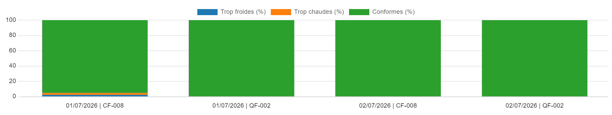

Les barres empilées utilisent le même dénominateur pour chaque périmètre. La
grande part verte ne doit pas masquer la petite taille du jeu : `100 %` sur une
journée signifie seulement qu'aucune des mesures reçues ce jour-là n'est sortie
de la plage.

### c. Dashboard de décision

Le dashboard Metabase est organisé du résumé vers le détail : trois indicateurs
en tête, une comparaison des périmètres, une courbe de seuils, puis les lignes à
investiguer. Il lit directement les vues `analytics` et `clean`. Metabase est
exécuté dans un conteneur dédié et conserve ses questions dans une base
PostgreSQL séparée, conformément au principe de persistance recommandé pour son
application.<sup>4</sup>

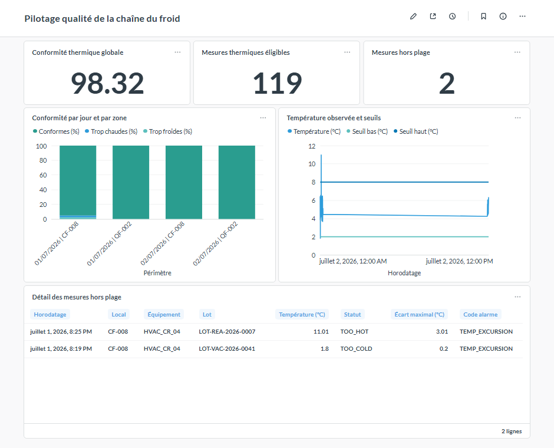

Les trois valeurs de tête se réconcilient : `117 / 119 = 98,32 %`, et les deux
mesures restantes apparaissent dans la table d'investigation. Le dashboard ne
crée donc pas un nouveau calcul ; il donne une forme exploitable aux résultats
du pipeline.

## IX. Recommandations

### a. Priorités proposées

| Priorité | Constat | Action | Critère de réussite |
| --- | --- | --- | --- |
| Immédiate | Deux écarts isolés dans `CF-008` | Vérifier les journaux d'alarme et la calibration du capteur | Cause documentée pour chaque écart |
| Immédiate | Une capture reste ouverte dans les métadonnées | Réconcilier processus actif et statut de capture | Aucun run `running` sans processus |
| Courte échéance | La durée des écarts n'est pas mesurable | Augmenter la continuité de collecte et regrouper les points en épisodes | Durée calculable pour chaque excursion |
| Courte échéance | Variables explicatives absentes | Ajouter consigne, ouverture de porte et état du groupe froid | Au moins 95 % de complétude |
| Moyenne échéance | Périmètre limité à deux locaux | Étendre la collecte aux autres zones froides | Comparaison sur plusieurs semaines |

### b. Seuils d'alerte

Une alerte ne doit pas dépendre uniquement d'un point hors plage. Je recommande
trois niveaux : un signal à surveiller pour un point isolé sans alarme, une
excursion à investiguer pour deux points successifs ou un code d'alarme, et une
alerte de qualité de données lorsque le taux de couverture descend sous le seuil
attendu. Ce troisième niveau évite qu'une zone silencieuse apparaisse comme
parfaitement conforme.

### c. Évolution de la plateforme

L'étape suivante est la planification du chargement, de `dbt run`, de `dbt test`
et du rafraîchissement du dashboard dans Airflow. Cette activation intervient
lorsque les dépendances et les reprises deviennent régulières.
Prometheus et Grafana surveilleront plutôt la santé technique : service actif,
retard d'ingestion, erreurs et durée des traitements. Ils ne remplacent pas le
dashboard qualité, dont les métriques sont métier.

Kafka reste une option d'architecture si le volume, le nombre de consommateurs
ou le besoin de rejeu le justifient. Le déclencheur doit être observable, par
exemple un débit soutenu que l'ingestion actuelle n'absorbe plus ou plusieurs
applications ayant besoin de relire indépendamment le même flux.

## X. Accompagnement des utilisateurs

### a. Public et objectifs

Le support s'adresse au responsable qualité, à la logistique, à la maintenance
et à l'équipe data. À la fin de la prise en main, chaque utilisateur doit savoir
identifier un écart, vérifier sa traçabilité, distinguer conformité et couverture
et exporter une vue sans modifier la donnée source.

### b. Parcours de prise en main

| Étape | Action | Point de vigilance |
| --- | --- | --- |
| Lire les indicateurs | Vérifier conformité, volume éligible et hors plage | Toujours lire le dénominateur |
| Localiser | Comparer date et local | Une journée courte n'est pas une tendance |
| Examiner | Ouvrir la table des mesures hors plage | Contrôler lot, équipement et alarme |
| Confirmer | Revenir aux données qualifiées | Le dashboard n'est pas la source brute |
| Escalader | Ouvrir une investigation qualité | Ne pas automatiser le statut du lot |

### c. Exercice de validation

Le cas proposé consiste à retrouver la mesure à `11,01 °C`, identifier son lot,
son équipement et son écart au seuil, puis expliquer pourquoi sa durée n'est pas
déductible d'un seul point. La réponse attendue distingue le fait observé, la
limite de la donnée et l'action à engager. Cette mise en situation vérifie la
compréhension du dashboard mieux qu'une simple visite de ses menus.

## XI. Documentation technique

### a. Procédure de reconstruction

Depuis PowerShell, la chaîne analytique et le notebook se reconstruisent avec :

```powershell
cd C:\Users\MAF\Desktop\certification_data_eng\pharma_coldchain_project
.\.venv\Scripts\Activate.ps1
.\scripts\run_bloc2_foundation.ps1
```

Le dashboard est ensuite démarré et régénéré sans enregistrer le mot de passe
administrateur dans le script :

```powershell
.\scripts\start_metabase.ps1 -NoBrowser
$env:METABASE_ADMIN_PASSWORD = "<mot-de-passe-administrateur>"
python .\scripts\bootstrap_metabase.py
```

### b. Contrôles de recette

La recette exécutée produit `6` modèles dbt et `20` tests réussis. Elle vérifie
également l'absence de duplication au chargement, l'exécution sans erreur des
`20` cellules du notebook et les six requêtes du dashboard. Les résultats
attendus sont `347` événements bruts, `119` mesures éligibles, `2` mesures hors
plage et une p-value de Fisher égale à `0,227318`.

### c. Sécurité et accès

Les données analytiques et les métadonnées Metabase sont stockées dans deux
bases distinctes. Les secrets sont fournis par variables d'environnement et le
fichier d'exemple ne contient qu'une valeur à remplacer. En environnement
partagé, les comptes doivent être séparés par rôle, le chiffrement en transit
activé et les droits limités selon un modèle RBAC. Les identifiants de lot et de
local sont suffisants pour l'analyse ; aucun nom d'entreprise ou donnée patient
n'est nécessaire dans le dashboard.

### d. Limites de la version

Cette version reste une fenêtre de qualification. Elle ne possède ni historique
de plusieurs semaines, ni données d'ouverture de porte, ni météo, ni état
détaillé du groupe froid. L'orchestration et la supervision technique sont
décrites comme évolutions, mais ne sont pas présentées comme déjà déployées. Ce
qui est montré dans les captures correspond aux services réellement exécutés.

### e. Lexique

| Terme | Définition dans ce dossier |
| --- | --- |
| DAG | Graphe orienté des dépendances entre modèles et traitements |
| dbt | Outil de transformation SQL et de tests de données |
| GDP | Bonnes pratiques de distribution des médicaments |
| KPI | Indicateur clé utilisé pour suivre une décision ou un risque |
| MQTT | Protocole léger de publication et d'abonnement pour les événements |
| RBAC | Contrôle des accès fondé sur des rôles |
| Mart | Table analytique préparée pour un besoin métier défini |
| p-value | Probabilité, sous `H0`, d'obtenir un résultat au moins aussi extrême |

### f. Conclusion

Le bloc II transforme une collecte technique en lecture métier contrôlée. Le
résultat le plus utile n'est pas seulement le taux de `98,32 %` : c'est la
capacité à expliquer son dénominateur, à retrouver les deux lignes qui le font
baisser et à dire honnêtement ce que le test statistique ne démontre pas encore.
La suite logique est donc moins d'ajouter des graphiques que d'allonger la
fenêtre, enrichir les variables et automatiser les contrôles qui rendent ces
graphiques fiables.

### g. Références

1. Commission européenne, *Guidelines on Good Distribution Practice of medicinal products for human use*, 2013/C 343/01 : <https://eur-lex.europa.eu/LexUriServ/LexUriServ.do?uri=OJ:C:2013:343:0001:0014:EN:PDF>
2. dbt Labs, *Add data tests to your DAG* : <https://docs.getdbt.com/docs/build/data-tests>
3. SciPy, *scipy.stats.fisher_exact* : <https://docs.scipy.org/doc/scipy/reference/generated/scipy.stats.fisher_exact.html>
4. Metabase, *Running Metabase on Docker* : <https://www.metabase.com/docs/latest/installation-and-operation/running-metabase-on-docker>
