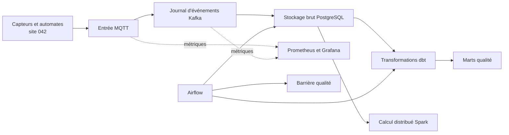
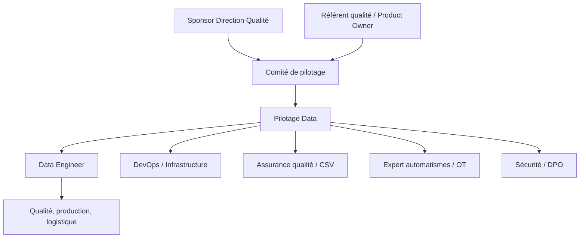
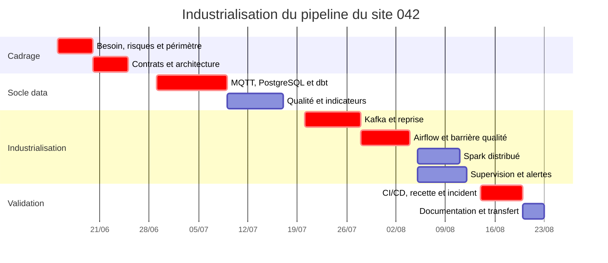
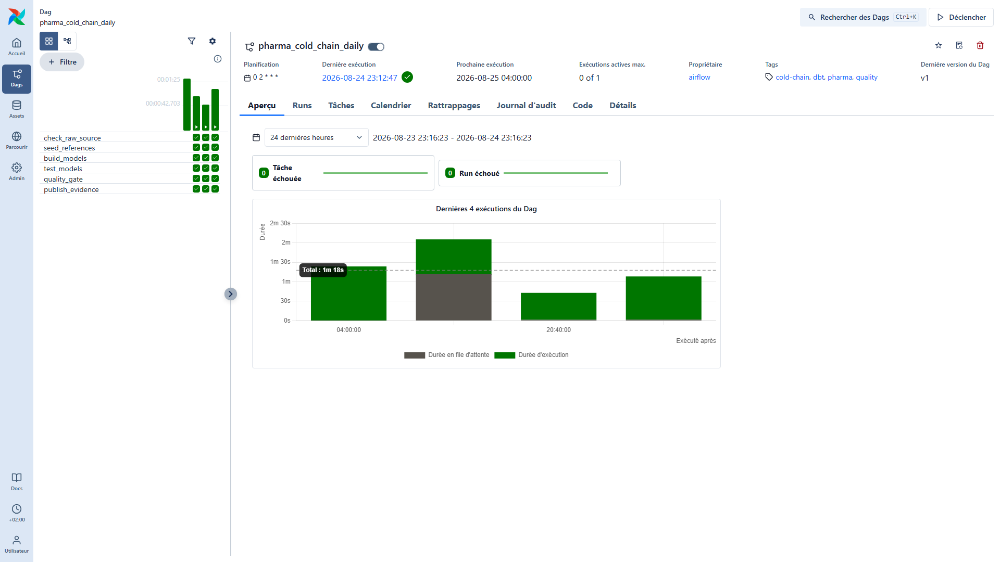
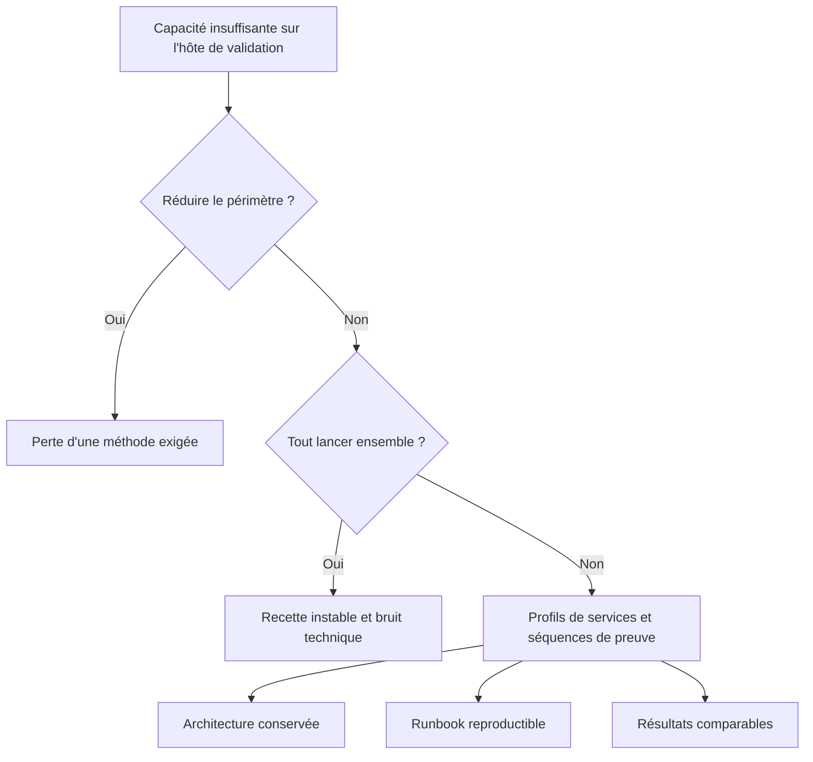
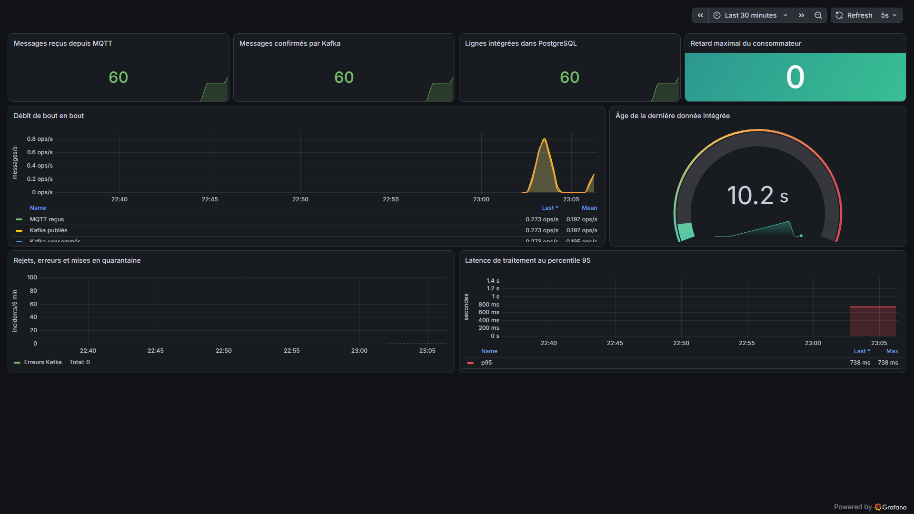
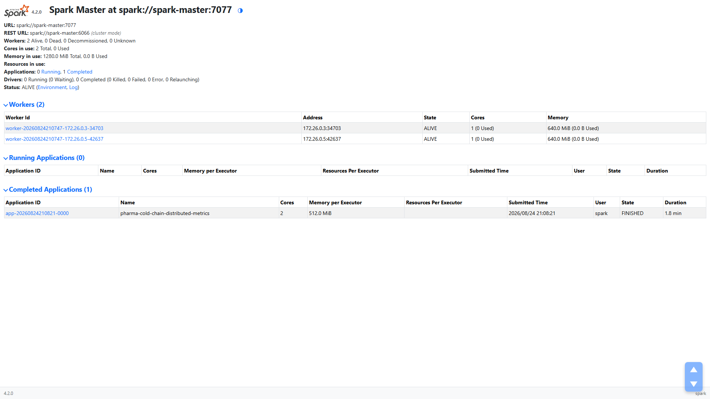

# Bloc III - Élaborer et piloter un projet data

## Industrialisation d'une plateforme de supervision de la chaîne du froid pharmaceutique

**Marc-Alfred FALIGANT**  
**Ynov - M2 Data Engineer - 2026**

Site étudié : **042** - organisation et personnes anonymisées

## Sommaire

  
I
Cadrage et problématique

  
II
Objectifs, périmètre et livrables

  
III
Contraintes, réglementation et RSE

  
IV
Parties prenantes et documentation

  
V
Dimensionnement et faisabilité

  
VI
Méthode de pilotage

  
VII
Planning, charges et responsabilités

  
VIII
Suivi de l'avancement

  
IX
Communication et management

  
X
Développement des compétences

  
XI
Cas d'arbitrage

  
XII
Veille technologique et réglementaire

  
XIII
Plan d'actions responsable et sécurisé

  
XIV
Résultats, limites et conclusion

Ce dossier décrit le pilotage d'une mise en situation professionnelle appliquée à un site pharmaceutique anonymisé. Les preuves techniques proviennent d'exécutions datées sur une plateforme de validation isolée. Les noms de personnes, l'entreprise et l'adresse d'hébergement ne sont pas nécessaires à la démonstration et ne sont donc pas exposés.

## I. Cadrage et problématique

### a. Point de départ

Le site 042 exploite plusieurs équipements susceptibles de produire des mesures hétérogènes : chambre froide qualifiée, quai d'expédition froid, ligne de remplissage, lyophilisateur, autoclave et utilités. La difficulté n'est pas seulement de recevoir une température. Il faut savoir de quelle machine elle vient, quelle règle lui est applicable, si le message a été perdu ou rejoué et à quel moment une donnée devient assez fiable pour alimenter une décision qualité.

La problématique retenue est donc la suivante :

> Comment industrialiser une chaîne de traitement qui conserve la trace des mesures, absorbe un flux continu, contrôle la qualité des données et rend les incidents visibles, sans transformer le projet en empilement d'outils impossible à exploiter ?

Le projet prolonge les blocs I et II : la collecte MQTT, le stockage PostgreSQL, les modèles dbt et les indicateurs de conformité existaient déjà sous forme de socle fonctionnel. Le bloc III traite le passage de ce socle à un projet pilotable, avec des responsabilités, un budget, des jalons et une stratégie de réduction des risques.

### b. Enjeux métier

| Enjeu | Question posée | Réponse attendue du projet |
| --- | --- | --- |
| Qualité | Peut-on expliquer chaque excursion thermique ? | Traçabilité du message brut jusqu'au mart analytique |
| Production | Le flux est-il encore actif ? | Mesure de fraîcheur et alerte d'interruption |
| Data | Peut-on rejouer sans créer de doublons ? | Clé d'idempotence, Kafka et contrôles dbt |
| Exploitation | Où se trouve une panne ? | Métriques par composant, logs et runbook |
| Direction | Le dispositif reste-t-il proportionné ? | Architecture dimensionnée, coûts visibles et trajectoire par étapes |

Les bonnes pratiques de distribution imposent de maintenir les conditions de stockage et de transport définies pour les médicaments, avec une documentation permettant l'investigation des écarts.[1](#ref-1) L'Annexe 11 des BPF ajoute une logique de gestion des risques, de validation et de maîtrise du cycle de vie pour les systèmes informatisés.[2](#ref-2) Ces textes ne dictent pas Kafka ou Airflow ; ils rendent surtout indispensable la preuve que le système fait ce qu'il est censé faire.

## II. Objectifs, périmètre et livrables

### a. Objectifs mesurables

| Objectif | Indicateur d'acceptation | Résultat observé au 24 août 2026 |
| --- | --- | --- |
| Découpler la collecte du stockage | Un topic brut partitionné et un groupe consommateur | `3` partitions, groupe opérationnel |
| Garantir la continuité du flux | Retard consommateur inférieur à `100` messages | Retard maximal observé : `0` |
| Publier une donnée qualifiée | Tests dbt et barrière qualité réussis | `20` tests dbt, statut `PASSED` |
| Orchestrer les traitements | DAG rejouable sans étape manuelle cachée | `6` tâches Airflow réussies |
| Prouver le calcul distribué | Deux workers et une sortie analytique | `527` entrées, `186` éligibles, `6` agrégats |
| Superviser la plateforme | Cibles, dashboard et alertes visibles | `3` cibles actives, `5` règles chargées |

### b. Périmètre

Le périmètre couvre la donnée machine et la qualification thermique des zones fixes. Il n'inclut ni donnée patient, ni décision automatique de libération d'un lot, ni commande directe d'un équipement. Une alerte signale un fait technique ; elle ne remplace pas l'analyse qualité.

### c. Livrables

Le projet produit une architecture exécutable, un modèle d'entrepôt, trois méthodes de traitement, un pipeline CI/CD défini, un dashboard de supervision, un cahier de recette, un runbook et les dossiers de certification. Les preuves sont des captures Full HD, des rapports JSON datés, des tests automatisés et des sorties SQL. Cette combinaison évite qu'une capture isolée soit prise pour toute la démonstration.

## III. Contraintes, réglementation et RSE

### a. Contraintes et points de vigilance

| Domaine | Contrainte | Traitement retenu |
| --- | --- | --- |
| Données | Messages irréguliers, doublons, schémas partiels | Empreinte `raw_hash`, DLQ, contrat de message |
| Temps réel | Producteur et base ne doivent pas être couplés | Kafka entre MQTT et PostgreSQL |
| Ressources | Capacité limitée de l'environnement de validation | Profils de services et recettes séquencées |
| Réglementaire | Toute évolution doit être explicable et testée | Versionnement, recette, preuve horodatée |
| Sécurité | Identifiants et ports d'administration sensibles | Anonymisation documentaire et durcissement cible |
| Planning | Compétences distribuées entre data, OT, QA et sécurité | RACI et jalons de validation croisée |

Le principe de minimisation du RGPD reste utile même sans données patient : un site, un local et une machine peuvent constituer des informations industrielles sensibles. Le projet conserve uniquement les attributs nécessaires au traitement et sépare les secrets de la documentation.[3](#ref-3)

### b. Enjeux responsables

L'enjeu RSE n'est pas résumé à « éteindre un serveur ». Il consiste à choisir la bonne intensité de calcul, la bonne durée de conservation et le bon niveau de redondance. Le temps réel est réservé à la détection ; le calcul distribué est utilisé pour les consolidations qui le justifient ; les données analytiques sont écrites en Parquet compressé ; les métriques techniques ont une rétention de quinze jours dans l'environnement de validation.

Le second volet concerne l'accessibilité du projet : documents lisibles sans dépendre uniquement de la couleur, textes alternatifs sur les figures, réunions accessibles à distance, comptes rendus asynchrones et adaptation des temps de formation lorsqu'un handicap ou une contrainte de santé le nécessite.

## IV. Parties prenantes et documentation projet

### a. Gouvernance cible

Les rôles décrivent l'organisation nécessaire à l'industrialisation. Ils ne prétendent pas que toutes ces fonctions ont travaillé à temps plein sur la plateforme de validation. Le sponsor arbitre le budget et les risques, le Product Owner ordonne les besoins métier, le pilotage Data maintient la cohérence d'ensemble, et l'assurance qualité conserve l'indépendance nécessaire pour accepter ou refuser une mise en service.

### b. Documentation de référence

| Document | Public | Finalité | Responsable de mise à jour |
| --- | --- | --- | --- |
| Note de cadrage | Sponsor, qualité, data | Périmètre, objectifs, risques, budget | Pilotage Data |
| Spécifications fonctionnelles | Qualité, production, data | Règles thermiques et usages attendus | Product Owner |
| Architecture et contrats | Data, OT, infrastructure | Flux, schémas, dépendances, sécurité | Data Engineer |
| Cahier de recette | QA/CSV, data, exploitation | Scénarios, preuves et critères d'acceptation | QA/CSV |
| Runbook | Exploitation et astreinte | Démarrage, surveillance, reprise | DevOps |
| Journal de décisions | COPIL et équipe | Arbitrages, hypothèses et impacts | Pilotage Data |

Le vocabulaire est volontairement double : un « retard Kafka » est expliqué comme le nombre de messages encore à traiter, et une « barrière qualité » comme la condition qui bloque une publication lorsqu'un contrôle échoue. La précision technique est conservée sans demander au commanditaire de lire le code pour comprendre le projet.

## V. Dimensionnement et faisabilité

### a. Charge humaine estimée

| Rôle | Charge | Taux journalier estimatif | Montant | Contribution principale |
| --- | ---: | ---: | ---: | --- |
| Pilotage / Data Engineer | 34 j | 600 € | 20 400 € | Architecture, pipelines, documentation |
| Product Owner qualité | 8 j | 720 € | 5 760 € | Besoin, règles, acceptation |
| DevOps / Infrastructure | 12 j | 650 € | 7 800 € | Conteneurs, CI/CD, exploitation |
| Assurance qualité / CSV | 10 j | 700 € | 7 000 € | Stratégie de validation et recette |
| Expert OT / automatismes | 6 j | 680 € | 4 080 € | Topics, équipements et contraintes terrain |
| Sécurité / DPO | 4 j | 750 € | 3 000 € | Accès, secrets, confidentialité |
| **Total humain** | **74 j** |  | **48 040 €** |  |

Cette estimation correspond à une industrialisation courte, pas au coût réellement facturé dans le cadre de la certification. Les taux servent à rendre l'hypothèse comparable et à détecter un sous-dimensionnement.

### b. Moyens matériels et budget

| Poste | Hypothèse | Estimation |
| --- | --- | ---: |
| Environnement de recette | Calcul, stockage, sauvegarde et réseau isolé | 1 200 € |
| Première année d'exploitation | Hébergement, sauvegardes, certificats, supervision | 3 000 € |
| Formation ciblée | Kafka, Airflow, Spark, sécurité et validation | 4 000 € |
| Ressources humaines | 74 jours | 48 040 € |
| Réserve de risque | 10 % des postes précédents | 5 624 € |
| **Budget de référence** |  | **61 864 €** |

Les licences des composants open source ne sont pas facturées, mais leur exploitation n'est pas gratuite. Le coût principal se trouve dans le temps de conception, les contrôles, la sécurité, les sauvegardes et la capacité à intervenir sur incident.

### c. Faisabilité et triangle qualité-coût-délai

Le délai cible est de dix semaines. La faisabilité est favorable si les interfaces avec les automates restent limitées à MQTT, si l'équipe dispose d'un référent OT et si la qualification fonctionnelle est conduite en parallèle du développement. Le chemin critique passe par le contrat de message, l'idempotence, la validation du modèle et la recette de reprise. Réduire ce chemin en supprimant les contrôles ferait gagner quelques jours sur le planning, mais déplacerait le coût vers l'exploitation et l'investigation d'incidents.

| Dimension | Cible | Tolérance | Décision en cas d'écart |
| --- | --- | --- | --- |
| Qualité | Aucun défaut bloquant de traçabilité | `0` anomalie critique ouverte | Publication suspendue |
| Coût | 61,9 k€ | +10 % sur décision du COPIL | Réduire le périmètre non critique |
| Délai | 10 semaines | Une semaine sur lot non critique | Maintenir recette et sécurité |

## VI. Méthode de pilotage

### a. Choix d'une approche hybride

Le projet utilise un Kanban pour le flux de travail et des jalons de validation proches d'une approche en V pour les éléments sensibles. Un Scrum strict aurait ajouté des cérémonies peu utiles à une équipe réduite et multi-métiers. Un cycle en V pur aurait, à l'inverse, retardé le retour obtenu en branchant progressivement MQTT, Kafka puis les contrôles.

Les colonnes du tableau sont : `À qualifier`, `Prêt`, `En cours`, `Revue technique`, `Recette qualité`, `Terminé`. La limite de travail en cours est fixée à deux éléments par personne. Une carte ne passe en recette que si son critère d'acceptation, sa preuve et sa procédure de retour arrière sont renseignés.

### b. Définition de terminé

Une fonctionnalité est terminée lorsque le code est relisible, le scénario nominal et l'échec principal sont testés, la métrique d'exploitation existe, le runbook est mis à jour et la preuve est conservée. Cette définition évite le classique « cela marche sur mon poste » qui devient parfois, sans prévenir, une méthode de gestion de projet.

## VII. Planning, charges et responsabilités

### a. Planning prévisionnel

Le calcul Spark et la supervision peuvent avancer en parallèle une fois le contrat de données stabilisé. Kafka, Airflow et la recette restent sur le chemin critique : une erreur d'idempotence ou une barrière qualité mal définie invaliderait plusieurs lots en aval.

### b. Matrice RACI

| Lot | Sponsor | PO Qualité | Pilotage Data | DevOps | QA/CSV | OT | Sécurité |
| --- | --- | --- | --- | --- | --- | --- | --- |
| Cadrage et budget | A | R | R | C | C | C | C |
| Contrat MQTT | I | C | R | C | C | A/R | C |
| Architecture data | I | C | A/R | R | C | C | C |
| Règles qualité | I | A/R | R | I | C | C | I |
| Orchestration et CI/CD | I | C | A | R | C | I | C |
| Recette et mise en service | I | C | R | R | A/R | C | C |
| Exploitation et incident | I | C | R | A/R | C | C | C |

`R` réalise, `A` porte la décision finale, `C` est consulté et `I` informé. Une seule responsabilité d'acceptation est recherchée par lot, même si plusieurs personnes contribuent.

### c. Répartition de charge

La charge maximale du Data Engineer intervient entre les semaines quatre et huit. Le DevOps rejoint le projet dès la conception de Kafka afin d'éviter que l'exploitation soit ajoutée à la fin. L'expert OT intervient peu de jours mais sur deux jalons critiques ; sa disponibilité est donc réservée à l'avance. Les revues QA/CSV sont réparties au fil de l'eau, plutôt qu'entassées dans une dernière semaine théorique où tout le monde découvre tout.

## VIII. Suivi de l'avancement

### a. Tableau de bord projet

| Indicateur | Calcul | Seuil | Valeur finale | État |
| --- | --- | --- | ---: | --- |
| Jalons techniques validés | jalons réussis / jalons prévus | 100 % avant recette | 8 / 8 | Conforme |
| Couverture du flux | faits analytiques / messages bruts | 100 % | 527 / 527 | Conforme |
| Tests de contrat | tests réussis / tests exécutés | 100 % | 10 / 10 | Conforme |
| Tests dbt | tests réussis / tests exécutés | 100 % | 20 / 20 | Conforme |
| Retard consommateur | messages non traités | < 100 | 0 | Conforme |
| Cibles supervisées | cibles actives / cibles attendues | 100 % | 3 / 3 | Conforme |
| Incidents critiques ouverts | nombre | 0 avant acceptation | 0 | Conforme |

Les indicateurs de résultat ne remplacent pas les indicateurs de pilotage. Le suivi hebdomadaire ajoute la charge consommée, la date prévisionnelle de chaque jalon, le nombre de blocages de plus de deux jours et la tendance budgétaire. Dans la mise en situation, le budget reste une projection ; je ne le présente donc pas comme une dépense réellement engagée.

### b. Tableau de suivi outillé

Le suivi est matérialisé dans un GitHub Project privé relié au dépôt versionné. Il comporte huit éléments identifiés de `PIL-01` à `PIL-08` et affiche, pour chacun, un jalon, un statut, un responsable et une échéance. Au 7 septembre 2026, les travaux de cadrage, d'ingestion, de transformation, d'observabilité, de collecte API et de CI/CD sont terminés ; la recette finale reste planifiée. Ce tableau complète le Gantt : il donne une lecture opérationnelle de l'avancement et conserve les responsables et les dates de décision.

<figure>
  
  <figcaption>Export de preuve généré depuis le GitHub Project privé : huit jalons, responsable, échéance et statut au 7 septembre 2026.</figcaption>
</figure>

### c. Compte rendu court

Chaque point hebdomadaire produit une page : décisions, risques, actions avec responsable et date, évolution du périmètre, puis statut qualité-coût-délai. Les journaux techniques restent attachés aux tickets. Le compte rendu ne copie pas les logs ; il traduit leur conséquence sur le projet.

<figure>
  
  <figcaption>Preuve de jalon : orchestration et barrière qualité réussies, capture Full HD du 24 août 2026.</figcaption>
</figure>

## IX. Communication et management de l'équipe

### a. Routines retenues

| Rituel | Fréquence | Participants | Sortie utile |
| --- | --- | --- | --- |
| Point flux | 15 min, trois fois par semaine | Équipe technique | Blocages et réaffectations |
| Revue métier | Hebdomadaire | PO, QA, Data, OT | Règles validées et décisions |
| Revue architecture | À chaque changement structurant | Data, DevOps, sécurité | ADR et impacts |
| COPIL | Toutes les deux semaines | Sponsor, PO, pilotage | QCD, risques et arbitrages |
| Retour d'expérience | Après incident ou jalon | Parties concernées | Action préventive et propriétaire |

La langue de référence des décisions et des procédures est le français ; les noms de champs, topics et composants restent en anglais pour respecter les conventions techniques. Dans un contexte international, les décisions sont résumées dans un anglais simple et les heures sont enregistrées en UTC dans les systèmes, puis affichées dans le fuseau de l'utilisateur.

### b. Outils collaboratifs

Le tableau Kanban porte le travail, Git porte le code et les revues, le journal d'architecture porte les décisions durables, et la documentation Markdown porte les procédures. Un message instantané peut déclencher une discussion, mais il ne constitue pas la décision finale. Cette règle limite la perte d'information quand une personne est absente ou travaille dans un autre fuseau.

### c. Inclusion et conditions de travail

Les réunions ont un ordre du jour, une durée limitée et un compte rendu. Les actions peuvent être suivies de manière asynchrone. Pour une personne malentendante, la visioconférence doit proposer des sous-titres et les décisions sont écrites. Pour une déficience visuelle, les statuts ne reposent pas sur la couleur seule et les schémas disposent d'une description. Pour une fatigue ou un trouble de l'attention, les formations sont découpées en modules courts avec temps supplémentaire et environnement calme. Ces adaptations sont définies avec la personne et le référent handicap, pas supposées à sa place.

## X. Développement des compétences

### a. Matrice d'écart

Échelle : `1` découverte, `2` pratique accompagnée, `3` autonomie, `4` capacité à concevoir et transmettre.

| Compétence | Niveau initial du projet | Cible | Écart | Preuve attendue |
| --- | ---: | ---: | ---: | --- |
| Modélisation SQL et dbt | 3 | 4 | 1 | Modèles, tests et documentation |
| MQTT et contrats d'événements | 3 | 4 | 1 | Topic, validation et rejeu |
| Kafka et sémantique de consommation | 2 | 3 | 1 | Partitions, offsets, lag, DLQ |
| Airflow | 2 | 3 | 1 | DAG, reprise et qualité |
| Spark distribué | 2 | 3 | 1 | Job sur deux workers et Parquet |
| Observabilité Prometheus/Grafana | 2 | 3 | 1 | Métriques, dashboard, alertes |
| Validation de système informatisé | 1 | 3 | 2 | Cahier de recette et traçabilité |
| Sécurité d'une plateforme data | 2 | 3 | 1 | Menaces, secrets, RBAC, TLS |

Cette grille est une autoévaluation de départ du projet. Dans une organisation réelle, elle est confrontée au manager et aux RH lors d'un entretien court, puis revue aux jalons de mi-parcours et de transfert.

### b. Plan de développement

| Action | Public | Modalité | Durée | Échéance | Résultat attendu |
| --- | --- | --- | ---: | --- | --- |
| Atelier contrats et idempotence | Data, OT | Cas pratique sur messages rejoués | 1 j | S3 | Aucun doublon après reprise |
| Parcours Kafka exploitation | Data, DevOps | Formation + exercice lag/DLQ | 2 j | S5 | Diagnostic autonome |
| Airflow et tests dbt | Data, QA | Binôme sur un DAG en échec | 1,5 j | S7 | Barrière qualité comprise |
| Spark et partitionnement | Data | TP distribué et revue du plan | 2 j | S8 | Job dimensionné et explicable |
| CSV / Annexe 11 | Data, QA, PO | Atelier avec spécialiste qualité | 1 j | S8 | Risques et preuves alignés |
| Incident et sécurité | Équipe | Exercice sur table | 0,5 j | S10 | Escalade et reprise maîtrisées |

Les supports sont fournis à l'avance dans un format modifiable. Des créneaux plus courts, un temps supplémentaire, une aide technique ou un poste adapté sont prévus avec les RH et le référent handicap en fonction du besoin exprimé.

## XI. Cas d'arbitrage rencontré

### a. Problème

L'environnement de validation ne pouvait pas faire fonctionner confortablement, au même instant, Kafka, Airflow, Spark, Prometheus, Grafana, PostgreSQL et l'outil de visualisation. Une exécution simultanée provoquait des démarrages lents et rendait les contrôles de santé moins lisibles. Trois options étaient possibles.

| Option | Avantage | Risque | Effet coût/délai |
| --- | --- | --- | --- |
| Tout exécuter sur un seul hôte | Démonstration continue | Contention mémoire, faux incidents | Faible coût, recette instable |
| Retirer Kafka ou Spark | Plateforme légère | Critères techniques non couverts, architecture limitée | Rapide mais insuffisant |
| Séparer les profils d'exécution | Recettes reproductibles, outils conservés | Captures réalisées par séquences | Petit effort documentaire |

### b. Décision

La troisième option a été retenue. Les profils `streaming`, `orchestration`, `distributed` et `observability` isolent les scénarios. PostgreSQL reste le point de continuité. Chaque séquence produit une preuve datée, puis libère les ressources pour la suivante. L'architecture cible conserve des services indépendants et peut les répartir sur plusieurs nœuds.

### c. Conséquences et réajustement

Le planning de recette a été ordonné : flux et supervision, puis Spark, puis Airflow et reconstruction analytique. Le runbook précise ce fonctionnement. L'arbitrage ne masque pas la limite ; il la transforme en procédure maîtrisée. Pour une mise en production, les profils deviennent des unités de déploiement séparées avec ressources garanties, authentification et haute disponibilité adaptées au niveau de service.

## XII. Veille technologique et réglementaire

### a. Méthode

La veille utilise une liste courte de sources primaires : documentation et notes de version des projets Apache, documentation Prometheus/Grafana, EudraLex, EUR-Lex et publications de l'autorité compétente. Une revue mensuelle classe chaque information selon quatre questions : le composant est-il concerné, le changement est-il obligatoire, quel risque apparaît si l'on ne fait rien, et quelle preuve faut-il mettre à jour ?

| Canal | Fréquence | Filtre | Sortie |
| --- | --- | --- | --- |
| Notes de version des composants | Mensuelle | Sécurité, rupture, fin de support | Ticket de mise à niveau |
| Documentation réglementaire | Trimestrielle | GDP, BPF, systèmes informatisés | Analyse d'impact QA |
| Alertes de sécurité | Hebdomadaire | Images et dépendances utilisées | Correctif ou acceptation de risque |
| Retour d'expérience interne | Après incident | Cause reproductible | Action préventive |

### b. Résultat d'une action de veille

Airflow 3 propose une architecture où les rôles et le gestionnaire d'authentification sont des sujets explicites ; sa documentation distingue le déploiement simple d'une architecture distribuée et multi-rôles.[4](#ref-4) L'environnement de validation utilise le gestionnaire d'authentification simple, ce qui facilite une recette isolée mais n'est pas un choix de production.

L'impact métier est concret : le passage en production doit intégrer un gestionnaire d'identité, des rôles séparés entre auteur de DAG, exploitation et administration, ainsi qu'un cycle de déploiement versionné. L'avantage est une meilleure séparation des responsabilités ; l'inconvénient est un coût d'intégration et de recette supérieur. Cette veille transforme donc une simple « page de login » en exigence d'architecture et en tâche budgétée.

Kafka conserve les événements selon une durée configurée et partitionne les topics afin de permettre l'échelle et la lecture parallèle ; l'ordre est garanti à l'intérieur d'une partition.[5](#ref-5) Cette propriété justifie le choix d'une clé machine et rappelle qu'un ordre global de toutes les machines n'est ni gratuit ni nécessaire.

## XIII. Plan d'actions responsable, sécurisé et éthique

### a. Priorisation

Les actions sont classées selon le risque métier, la vraisemblance et l'effort. La confidentialité et l'intégrité passent avant l'optimisation énergétique, car une donnée altérée peut entraîner une mauvaise investigation qualité. L'écoconception reste intégrée dès qu'elle ne réduit pas la capacité de preuve.

| Priorité | Sujet | Action | Délai | Coût estimé | Résultat attendu |
| --- | --- | --- | --- | ---: | --- |
| P0 | Secrets | Gestionnaire de secrets et rotation | Avant préproduction | 2 500 € | Aucun secret dans le dépôt |
| P0 | Chiffrement | TLS MQTT/Kafka/HTTP et certificats | Avant préproduction | 4 000 € | Flux chiffrés et identifiés |
| P0 | Accès | RBAC, comptes nominatifs, moindre privilège | 3 semaines | 3 000 € | Séparation administration/lecture |
| P0 | Intégrité | Sauvegarde et test de restauration | 3 semaines | 2 500 € | RPO/RTO vérifiés |
| P1 | Traçabilité | Journaux d'accès et décisions de publication | 4 semaines | 2 000 € | Investigation reconstituable |
| P1 | Confidentialité | Pseudonymisation des sites et rétention | 4 semaines | 1 500 € | Exposition documentaire réduite |
| P1 | Sobriété | Rétention par usage, compression, extinction des environnements non actifs | 6 semaines | 1 000 € | Stockage et calcul proportionnés |
| P2 | Accessibilité | Audit des supports et procédures | 8 semaines | 1 200 € | Utilisation sans dépendre de la couleur ou de l'audio |

### b. Données responsables

Les identifiants de lot sont nécessaires à la traçabilité, mais les coordonnées géographiques précises ne sont pas utiles au calcul thermique. Elles sont donc exclues des marts et conservées, si un besoin OT existe, dans un référentiel à accès restreint. Les données brutes restent immuables pendant leur période de conservation ; une correction produit une nouvelle version de la règle et ne réécrit pas silencieusement l'historique.

Une alerte n'est déclenchée que si une action est possible et un propriétaire identifié. Cette approche réduit le bruit d'alerte et rejoint la recommandation de Grafana selon laquelle une alerte doit être actionnable, posséder un périmètre et une responsabilité explicites.[6](#ref-6)

### c. Éthique et décision

Le système ne conclut pas qu'un lot est libérable. Il signale une excursion, sa durée, sa zone, son écart et la qualité de la preuve. La décision reste attribuée à la fonction qualité. Cette frontière est importante : automatiser le calcul améliore la cohérence ; automatiser une décision réglementée sans validation suffisante déplacerait simplement l'erreur derrière un écran plus joli.

## XIV. Résultats, limites et conclusion

### a. Résultats du projet

  <figure>
    
    <figcaption>Flux de bout en bout : 60 messages sur la séquence capturée et retard Kafka nul.</figcaption>
  </figure>
  <figure>
    
    <figcaption>Calcul distribué : deux workers actifs et application terminée avec succès.</figcaption>
  </figure>

Le projet atteint le niveau de preuve attendu pour une mise en situation : le flux est exécutable, les trois méthodes de traitement produisent les données attendues, les tests sont rejouables et les interfaces de supervision rendent l'état du système visible. Le pilotage ne repose pas seulement sur la présence d'outils ; il relie chaque composant à un besoin, un risque, un responsable et une procédure.

### b. Limites assumées

La plateforme est une validation représentative, pas une installation industrielle qualifiée. Le broker Kafka est mono-nœud, les flux de validation ne sont pas chiffrés, le gestionnaire d'authentification Airflow est simplifié, la haute disponibilité n'est pas démontrée et le pipeline CI/CD n'a pas encore été exécuté sur un dépôt distant. Ces points deviennent des conditions de passage en préproduction, pas des détails cachés.

Snowflake a été étudié comme possibilité de cible cloud, mais n'a pas été ajouté uniquement parce qu'un compte était disponible. PostgreSQL, Parquet et Spark couvrent le besoin et donnent une preuve plus cohérente. Une migration Snowflake devra être décidée sur le volume, l'exploitation, la résidence des données et le coût total, puis faire l'objet d'une recette distincte.

### c. Conclusion

Le principal résultat du bloc III est d'avoir transformé une suite de travaux data en projet gouvernable. Le cadrage fixe la frontière entre supervision et décision qualité, le dimensionnement rend le coût visible, le planning protège les jalons critiques, et l'arbitrage de capacité démontre qu'une contrainte technique peut être traitée sans réduire silencieusement l'objectif. La suite logique n'est pas d'ajouter un nouvel outil : c'est de durcir les accès, exécuter la CI sur un dépôt contrôlé, tester la restauration et faire accepter les preuves par la qualité.

## Références

**1.** Commission européenne, *Guidelines of 5 November 2013 on Good Distribution Practice of medicinal products for human use*, 2013/C 343/01. [EUR-Lex](https://eur-lex.europa.eu/LexUriServ/LexUriServ.do?uri=OJ%3AC%3A2013%3A343%3A0001%3A0014%3AEN%3APDF).

**2.** Commission européenne, *EudraLex Volume 4, Annex 11: Computerised Systems*. [Document officiel](https://health.ec.europa.eu/document/download/8d305550-dd22-4dad-8463-2ddb4a1345f1_en).

**3.** Union européenne, *Règlement (UE) 2016/679*, article 5 : principes relatifs au traitement des données à caractère personnel. [EUR-Lex](https://eur-lex.europa.eu/eli/reg/2016/679/oj).

**4.** Apache Airflow, *Architecture Overview*, documentation 3.3.1. [Documentation officielle](https://airflow.apache.org/docs/apache-airflow/stable/core-concepts/overview.html).

**5.** Apache Kafka, *Introduction and core concepts*. [Documentation officielle](https://kafka.apache.org/documentation/).

**6.** Grafana Labs, *Alerting best practices*. [Documentation officielle](https://grafana.com/docs/grafana/latest/alerting/guides/best-practices/).

## Lexique

| Terme | Définition dans le projet |
| --- | --- |
| BPF / GMP | Bonnes pratiques de fabrication / Good Manufacturing Practices |
| CSV | Computer System Validation, validation d'un système informatisé |
| DLQ | File réservée aux messages rejetés pour analyse et reprise |
| GDP | Good Distribution Practice, bonnes pratiques de distribution |
| Idempotence | Capacité à rejouer un traitement sans dupliquer son effet |
| OT | Operational Technology, systèmes et équipements industriels |
| RACI | Responsable, Approbateur, Consulté, Informé |
| RBAC | Contrôle d'accès fondé sur des rôles |
| RPO / RTO | Perte de données admissible / délai de rétablissement visé |

## Annexe - Correspondance des preuves

| Compétence | Élément principal du dossier | Preuve associée |
| --- | --- | --- |
| C3.1.1 | I à III | Problématique, objectifs, contraintes et enjeux RSE |
| C3.1.2 | V | Charge, budget, faisabilité et QCD |
| C3.1.3 | IV | Gouvernance et référentiel documentaire |
| C3.2.1 | VI et VII | Méthode, Gantt, chemin critique et RACI |
| C3.2.2 | VIII | Tableau de bord, indicateurs et compte rendu |
| C3.3.1 | X | Matrice d'écart et plan de formation |
| C3.3.2 | IX | Charge, routines, multiculturalité et handicap |
| C3.3.3 | XI | Arbitrage de capacité et réajustement |
| C3.4.1 | XII | Méthode et résultat de veille |
| C3.4.2 | XIII | Plan d'actions chiffré et priorisé |
