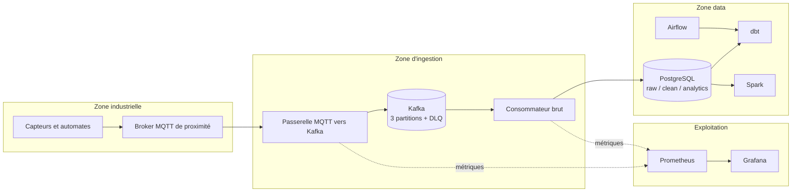
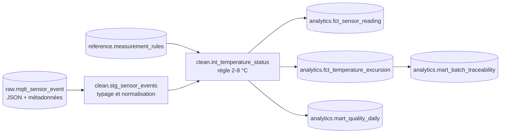
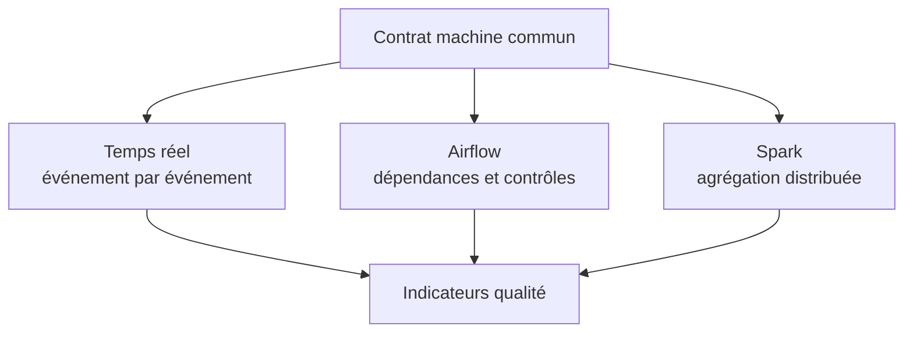
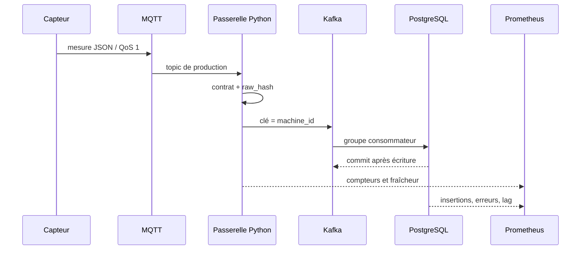
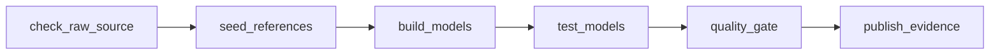
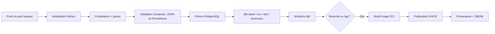
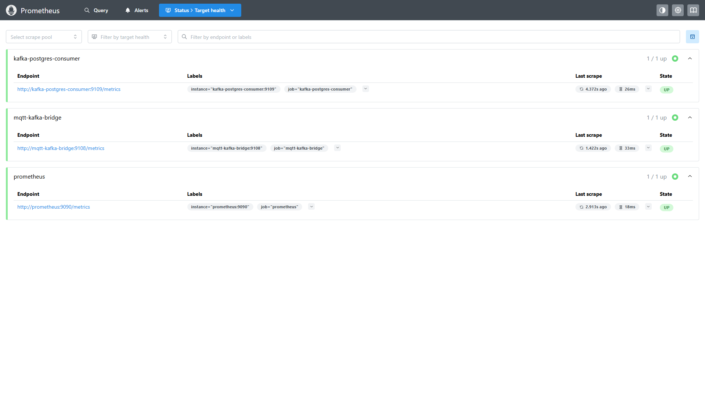
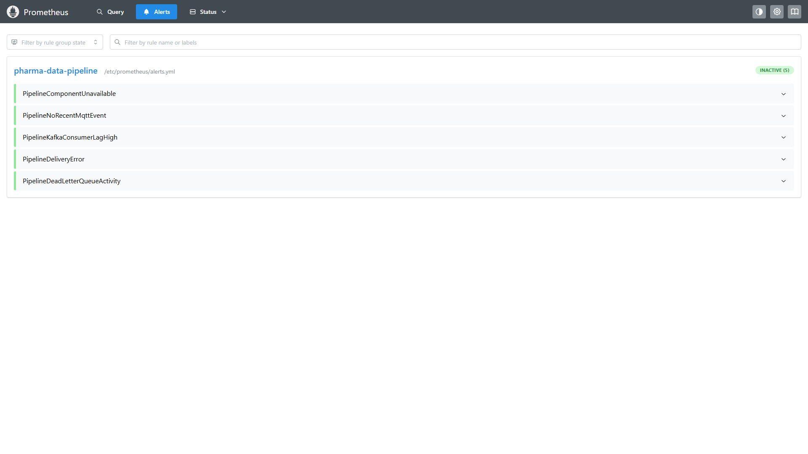

<section class="slide cover-slide" markdown="1">

# Bloc IV - Concevoir et opérer une infrastructure data

## Plateforme de supervision de la chaîne du froid pharmaceutique

**Marc-Alfred FALIGANT**  
**Ynov - M2 Data Engineer - 2026**

Site étudié : **042** - périmètre industriel anonymisé

</section>

<section class="slide" markdown="1">

## Trajectoire de la présentation

<div class="columns-2">
<div>
<table>
<thead><tr><th>Partie</th><th>Question traitée</th></tr></thead>
<tbody>
<tr><td>I</td><td>Quel besoin et quel existant ?</td></tr>
<tr><td>II</td><td>Quels composants et à quel coût ?</td></tr>
<tr><td>III</td><td>Comment les données sont-elles organisées ?</td></tr>
<tr><td>IV</td><td>Les trois traitements produisent-ils le résultat ?</td></tr>
<tr><td>V</td><td>Comment intégrer et livrer ?</td></tr>
</tbody>
</table>
</div>
<div>
<table>
<thead><tr><th>Partie</th><th>Question traitée</th></tr></thead>
<tbody>
<tr><td>VI</td><td>Comment détecter une panne ?</td></tr>
<tr><td>VII</td><td>Comment maintenir et transmettre ?</td></tr>
<tr><td>VIII</td><td>Qu'est-ce qui a été testé ?</td></tr>
<tr><td>IX</td><td>Quel incident a réellement été résolu ?</td></tr>
<tr><td>X</td><td>Que manque-t-il avant la production ?</td></tr>
</tbody>
</table>
</div>
</div>

<p class="lead">Le fil directeur est simple : une donnée machine n'a de valeur que si l'on peut expliquer son origine, son traitement, son état de qualité et la manière de rétablir le service lorsqu'un composant échoue.</p>

</section>

<section class="slide" markdown="1">

## I.a. Besoin métier et résultat principal

<p class="lead">Le périmètre industriel doit relier des signaux machines continus à des indicateurs qualité sans perdre la trace du message original.</p>

<div class="metric-grid">
  <div class="metric"><strong>527</strong><span>événements bruts conservés</span></div>
  <div class="metric"><strong>527</strong><span>faits reconstruits après dbt</span></div>
  <div class="metric"><strong>3</strong><span>excursions thermiques qualifiées</span></div>
</div>

| Utilisateur | Besoin | Donnée livrée |
| --- | --- | --- |
| Qualité | Identifier et expliquer une excursion | Lot, zone, durée, amplitude, statut |
| Production | Vérifier que le flux continue | Fraîcheur, volume, erreur de livraison |
| Data / exploitation | Diagnostiquer et rejouer | Offset, empreinte, DLQ, logs, métriques |
| Direction | Maîtriser le risque et le coût | Architecture, disponibilité, feuille de route |

<div class="panel">La plateforme automatise la qualification et la preuve. Elle ne décide pas de la libération d'un lot.</div>

</section>

<section class="slide" markdown="1">

## I.b. État de l'existant

<div class="columns-2">
<div>
<h3>Socle déjà fonctionnel</h3>
<ul>
<li>messages MQTT structurés par site, type de machine et identifiant ;</li>
<li>stockage PostgreSQL brut avec empreinte d'idempotence ;</li>
<li>modèles dbt <code>staging</code>, intermédiaires, faits et marts ;</li>
<li>analyse de conformité thermique dans les zones fixes ;</li>
<li>documentation Markdown et premières preuves SQL.</li>
</ul>
</div>
<div>
<h3>Écarts avant industrialisation</h3>
<ul>
<li>couplage trop direct entre réception et base ;</li>
<li>absence d'orchestrateur exécutable ;</li>
<li>pas de calcul distribué démontré ;</li>
<li>métriques et alertes encore dispersées ;</li>
<li>procédure de reprise et CI/CD incomplètes.</li>
</ul>
</div>
</div>


</section>

<section class="slide" markdown="1">

## I.c. Volumes et exigences non fonctionnelles

| Dimension | Validation actuelle | Cible d'industrialisation |
| --- | ---: | --- |
| Débit | Séquences de 1 message/s | Plusieurs centaines de messages/s par ajout de partitions |
| Volume brut | 527 événements de preuve | Rétention Kafka courte + stockage durable dimensionné |
| Latence | Mesurée au percentile 95 | Alerte et objectif de service définis avec l'exploitant |
| Complétude | 527 faits / 527 bruts | 100 % ou publication bloquée |
| Reprise | Offset Kafka + `raw_hash` | Rejeu contrôlé et procédure testée |
| Disponibilité | Services indépendants, recettes séquencées | Réplication et ressources garanties selon criticité |

<div class="columns-3">
  <div class="panel"><strong>Intégrité</strong><br>Un message ne devient pas deux lignes après rejeu.</div>
  <div class="panel"><strong>Observabilité</strong><br>Chaque rupture du flux possède une métrique et un seuil.</div>
  <div class="panel"><strong>Auditabilité</strong><br>Une publication analytique conserve sa preuve datée.</div>
</div>

<p class="small">Les volumes de validation prouvent le comportement, pas la capacité maximale. Un test de charge dédié reste nécessaire avant dimensionnement définitif.</p>

</section>

<section class="slide" markdown="1">

## I.d. Contraintes et cadre de maîtrise

| Contrainte | Risque | Réponse d'architecture |
| --- | --- | --- |
| Messages JSON hétérogènes | Champ absent ou valeur illisible | Contrat, validation et DLQ |
| Producteurs intermittents | Faux calme ou donnée périmée | Métrique de fraîcheur |
| Rejeu après incident | Doublons en base | Producteur idempotent et `raw_hash` unique |
| Système informatisé pharmaceutique | Résultat non démontrable | Recette, journal de décisions, preuve horodatée |
| Informations industrielles sensibles | Exposition du site ou des lots | Site pseudonymisé, accès par rôle, rétention |
| Capacité de validation limitée | Contention entre composants | Profils de services et exécutions séquencées |

Les GDP demandent de maintenir les conditions définies de stockage et de distribution et de documenter les écarts.<sup>[1](#source-1)</sup> L'Annexe 11 rattache les systèmes informatisés à une démarche de risque, de validation, de sécurité et de continuité.<sup>[2](#source-2)</sup>

<div class="panel">Ces textes orientent la preuve et les responsabilités. Ils ne prescrivent pas un produit technique précis.</div>

</section>

<section class="slide" markdown="1">

## II.a. Architecture cible



<p class="caption">Les frontières séparent la donnée industrielle, l'ingestion, le traitement et l'exploitation. La cible de production ajoute TLS, identités techniques, secrets externalisés et redondance.</p>

</section>

<section class="slide" markdown="1">

## II.b. Composants sélectionnés

| Composant | Version de preuve | Rôle | Avantage | Vigilance |
| --- | --- | --- | --- | --- |
| Mosquitto | 2.0.22 | Entrée MQTT | Léger, adapté aux équipements | Authentification/TLS à durcir |
| Kafka | 4.3.1 | Journal et découplage | Rejeu, partitions, groupes | Exploitation et réplication |
| PostgreSQL | 16.14 | Entrepôt | SQL, contraintes, JSON | Partitionnement à anticiper |
| dbt Core | Projet versionné | Transformation | Lignage et tests proches du SQL | Discipline de modèle |
| Airflow | 3.3.1 | Orchestration | Dépendances, reprise, historique | Auth manager et haute disponibilité |
| Spark | 4.2.0 | Calcul distribué | Parallélisme et Parquet | Coût de démarrage sur petits volumes |
| Prometheus | 3.13.0 | Métriques et règles | PromQL, simplicité de collecte | Cardinalité et rétention |
| Grafana | 13.1.0 | Visualisation | Dashboard provisionné | RBAC et gouvernance des alertes |

Kafka conserve les événements indépendamment de leur consommation et les répartit en partitions, ce qui permet la lecture parallèle et le rejeu.<sup>[3](#source-3)</sup> Spark exécute les tâches sur des processus workers coordonnés par le driver et un gestionnaire de cluster.<sup>[4](#source-4)</sup>

</section>

<section class="slide" markdown="1">

## II.c. Coûts, compatibilité et alternatives

| Option | Coût licence | Exploitation | Verrouillage | Décision |
| --- | ---: | --- | --- | --- |
| Socle open source opéré | 0 € | Équipe nécessaire | Faible à moyen | Retenu pour la preuve et la maîtrise |
| Services managés Kafka/Spark | À l'usage | Plus faible | Moyen | Pertinent si le SRE est limité |
| Snowflake | À la consommation | Entrepôt simplifié | Moyen à fort | Option de cible, non activée |
| PostgreSQL seul | Faible | Simple | Faible | Insuffisant pour découplage et Spark exigés |

<div class="columns-2">
<div class="panel">
<strong>Ordre de grandeur annuel cible</strong><br>
Infrastructure, sauvegardes, certificats et supervision : <strong>6 à 18 k€</strong>, hors temps humain et haute disponibilité multi-site.
</div>
<div class="panel">
<strong>Décision Snowflake</strong><br>
Un compte disponible n'est pas une justification d'architecture. Sans volumétrie durable, contraintes de résidence, profils de requêtes et budget de crédits, une connexion supplémentaire n'apporte pas de preuve utile.
</div>
</div>

<p class="small">La compatibilité est assurée par des interfaces ouvertes : MQTT, protocole Kafka, SQL, JSON, Parquet et HTTP/OpenMetrics. Le chiffrage définitif nécessite un test de charge et des objectifs RPO/RTO contractuels.</p>

</section>

<section class="slide" markdown="1">

## III.a. Organisation de l'entrepôt



| Niveau | Données | Accès principal |
| --- | --- | --- |
| Brut | JSON, topic, QoS, broker, partition, offset, hash | Ingestion et audit |
| Nettoyé | Types SQL, horodatages UTC, machine, zone, lot | Data Engineer et QA |
| Analytique | Faits détaillés et excursions | Qualité et analyse |
| Mart | Agrégats journaliers et traçabilité lot | Dashboard et reporting |

</section>

<section class="slide" markdown="1">

## III.b. Lignage et règles de transformation

<div class="columns-2">
<div>
<h3>Règles principales</h3>
<ul>
<li><code>raw_hash</code> unique pour l'idempotence ;</li>
<li>UTC pour calculer sans ambiguïté ;</li>
<li>règle thermique appliquée seulement à la chambre froide et au quai froid ;</li>
<li>statut <code>TOO_COLD</code>, <code>OK</code>, <code>TOO_HOT</code> ;</li>
<li>excursion mesurée en durée et degrés-minutes ;</li>
<li>mart publié uniquement après les tests.</li>
</ul>
</div>
<div>
<h3>Tests dbt</h3>
<ul>
<li>non-nullité des clés et horodatages ;</li>
<li>unicité de l'empreinte ;</li>
<li>valeurs acceptées des états ;</li>
<li>relation vers le référentiel des machines ;</li>
<li>fraîcheur de la source ;</li>
<li>complétude brute/faits dans Airflow.</li>
</ul>
</div>
</div>

<div class="metric-grid">
  <div class="metric"><strong>20/20</strong><span>tests dbt réussis</span></div>
  <div class="metric"><strong>6</strong><span>lignes dans le mart journalier</span></div>
  <div class="metric"><strong>100 %</strong><span>brut réconcilié avec les faits</span></div>
</div>

<p class="small">Le terme « brut » désigne ici une donnée reçue et enveloppée, sans correction métier. Son intégrité est conservée même si une règle analytique évolue ensuite.</p>

</section>

<section class="slide" markdown="1">

## III.c. Accès, rapidité et sécurité

| Usage | Relation | Mode d'accès | Protection cible |
| --- | --- | --- | --- |
| Audit d'ingestion | `raw.mqtt_sensor_event` | Lecture restreinte, requêtes ciblées | Rôle technique, journalisation |
| Transformation | `clean.*` | Compte dbt dédié | Écriture limitée au schéma |
| Qualité | `analytics.fct_*` | Lecture SQL / outil BI | Vue filtrée, compte nominatif |
| Reporting | `analytics.mart_*` | Dashboard | Lecture seule, cache contrôlé |
| Traitement distribué | Export Parquet | Stockage objet ou volume dédié | Chiffrement et politique de rétention |

<div class="columns-2">
<div class="panel"><strong>Performance</strong><br>Index sur empreinte et temps, marts pré-agrégés, partitionnement temporel à partir d'un volume seuil.</div>
<div class="panel"><strong>Sécurité</strong><br>RBAC, comptes de service séparés, TLS, secrets externalisés, sauvegardes chiffrées et restauration testée.</div>
</div>

Le modèle exposé ne contient pas de donnée patient. Il reste néanmoins sensible par ses lots, zones et états de production. La minimisation et la limitation d'accès sont donc appliquées à l'information industrielle comme une règle de conception, pas comme un habillage documentaire.<sup>[5](#source-5)</sup>

</section>

<section class="slide" markdown="1">

## IV.a. Trois méthodes, un même contrat

| Méthode | Temporalité | Entrée | Sortie | Preuve |
| --- | --- | --- | --- | --- |
| Pipeline Python temps réel | Continue | MQTT JSON | Kafka puis PostgreSQL brut | Compteurs égaux et lag nul |
| Orchestration Airflow | Quotidienne / rejouable | Table brute | Modèles dbt et preuve qualité | Six tâches vertes |
| Calcul distribué Spark | Asynchrone | Export JSONL | Agrégats Parquet | Deux workers, application terminée |



<div class="panel">Les trois chemins ne produisent pas trois vérités concurrentes. Ils appliquent les mêmes définitions de machine, de zone et de conformité à des horizons de traitement différents.</div>

</section>

<section class="slide" markdown="1">

## IV.b. Méthode I - pipeline temps réel



| Garantie | Implémentation |
| --- | --- |
| Livraison Kafka | `acks=all`, idempotence, compression zstd |
| Ordre utile | Clé `machine_id` vers une même partition |
| Reprise | Offset du groupe validé après commit PostgreSQL |
| Doublon | Contrainte sur `raw_hash` |
| Message invalide | Topic `pharma.sensor.dlq.v1` |

</section>

<section class="slide" markdown="1">

## IV.c. Contrat et reprise dans le code

<div class="columns-2">
<div>

```python
producer = Producer({
    "bootstrap.servers": kafka_servers,
    "enable.idempotence": True,
    "acks": "all",
    "compression.type": "zstd",
})

envelope = {
    "schema_version": 1,
    "received_at": utc_now(),
    "raw_hash": message_hash(
        message.topic, message.payload
    ),
    "payload": payload,
}
```

</div>
<div markdown="1">

```python
validate_envelope(envelope)
event = normalized_event(
    envelope,
    message.partition(),
    message.offset(),
)
cursor.execute(INSERT_SQL, event)
connection.commit()
consumer.commit(
    message=message,
    asynchronous=False,
)
```

</div>
</div>

<div class="panel">Le commit Kafka intervient après le commit PostgreSQL. Si l'écriture échoue, l'offset n'avance pas ; si le message est rejoué, l'empreinte empêche le doublon.</div>

<p class="small">Sources exécutables : `src/mqtt_to_kafka.py`, `src/kafka_to_postgres.py` et `src/pipeline_contracts.py`.</p>

</section>

<section class="slide" markdown="1">

## IV.d. Preuve du flux temps réel

<figure>
  
  <figcaption>Capture Full HD : 60 messages MQTT, 60 publications Kafka, 60 insertions PostgreSQL, lag maximal égal à zéro.</figcaption>
</figure>

<div class="metric-grid">
  <div class="metric"><strong>60 = 60 = 60</strong><span>réception, publication, insertion sur la séquence</span></div>
  <div class="metric"><strong>0</strong><span>message en retard au moment du contrôle</span></div>
  <div class="metric"><strong>10,2 s</strong><span>âge de la dernière donnée lors de la capture</span></div>
</div>

<p class="small">Le débit n'est pas un test de charge. La preuve porte ici sur la continuité, la réconciliation des compteurs et la visibilité de la latence.</p>

</section>

<section class="slide" markdown="1">

## IV.e. Méthode II - orchestration Airflow



```python
@dag(
    dag_id="pharma_cold_chain_daily",
    schedule="0 2 * * *",
    catchup=False,
    max_active_runs=1,
    default_args={
        "retries": 2,
        "retry_delay": timedelta(minutes=2),
    },
)
```

Airflow représente le workflow sous forme de Dag : calendrier, tâches, dépendances, reprises et statut d'exécution sont traités comme un même objet.<sup>[6](#source-6)</sup>

<div class="panel">La barrière qualité compare le nombre de faits au nombre de messages bruts. Un écart bloque la preuve de publication, même si la commande dbt s'est techniquement terminée.</div>

</section>

<section class="slide" markdown="1">

## IV.f. Preuve de l'orchestration

<figure>
  
  <figcaption>Capture Full HD du 24 août 2026 : dernière exécution réussie, six tâches vertes et aucun échec.</figcaption>
</figure>

<div class="metric-grid">
  <div class="metric"><strong>527</strong><span>messages bruts contrôlés</span></div>
  <div class="metric"><strong>527</strong><span>faits après reconstruction</span></div>
  <div class="metric"><strong>PASSED</strong><span>barrière qualité et preuve JSON</span></div>
</div>

</section>

<section class="slide" markdown="1">

## IV.g. Méthode III - calcul distribué Spark

<div class="columns-2">
<div markdown="1">

```python
raw = (
    spark.read.schema(SCHEMA)
    .json(INPUT_PATH)
    .repartition(4, "machine_id")
)

daily = (
    qualified
    .groupBy(
        "observation_date",
        "site_id", "zone", "room_id"
    )
    .agg(
        F.count("*").alias(
            "eligible_reading_count"
        ),
        F.avg("temperature_c")
    )
)
```

</div>
<div>
<h3>Plan d'exécution</h3>
<ul>
<li>master Spark autonome ;</li>
<li>deux workers, un cœur chacun ;</li>
<li>deux exécuteurs de <code>512 Mio</code> ;</li>
<li>schéma imposé à la lecture JSON ;</li>
<li>repartitionnement par machine ;</li>
<li>agrégation par date, site, zone et local ;</li>
<li>écriture Parquet partitionnée par date.</li>
</ul>
<p>Le driver distribue le code et les tâches aux exécuteurs alloués par le gestionnaire de cluster.<sup><a href="#source-4">4</a></sup></p>
</div>
</div>

<div class="panel">Spark n'est pas plus rapide par principe sur 527 lignes. Sa présence démontre la méthode distribuée et prépare les consolidations volumineuses ; le pipeline SQL/dbt reste plus rationnel pour les petits traitements quotidiens.</div>

</section>

<section class="slide" markdown="1">

## IV.h. Preuve du calcul distribué

<figure>
  
  <figcaption>Capture Full HD : deux workers actifs, deux cœurs disponibles, application `pharma-cold-chain-distributed-metrics` terminée.</figcaption>
</figure>

<div class="metric-grid">
  <div class="metric"><strong>527</strong><span>événements lus</span></div>
  <div class="metric"><strong>186</strong><span>mesures thermiques éligibles</span></div>
  <div class="metric"><strong>6</strong><span>agrégats Parquet écrits</span></div>
</div>

</section>

<section class="slide" markdown="1">

## V.a. Pipeline CI/CD défini



```yaml
delivery:
  needs: quality
  steps:
    - uses: docker/build-push-action@v6
      with:
        push: true
        tags: ghcr.io/...:${{ github.sha }}
        provenance: true
        sbom: true
```

GitHub documente la construction et la publication d'images de conteneur comme une étape automatisable d'un workflow Actions.<sup>[7](#source-7)</sup>

</section>

<section class="slide" markdown="1">

## V.b. Ce qui est vérifié, et ce qui ne l'est pas encore

| Étape | Exécutée sur la plateforme | Définie dans la CI distante |
| --- | --- | --- |
| Compilation des scripts | Oui | Oui |
| Tests Python | Oui, `9/9` | Oui |
| Manifestes Compose et Prometheus | Oui | Oui |
| dbt `seed/run/test/freshness` | Oui | Oui |
| Construction de l'image | Oui lors des services | Oui, image versionnée |
| Publication GHCR | Non | Oui |
| SBOM et provenance | Non | Oui |

<p class="lead">Le workflow est implémenté dans le dépôt, mais aucune exécution GitHub distante n'est revendiquée.</p>

<div class="columns-2">
<div class="panel"><strong>Condition d'acceptation</strong><br>Publier le dépôt contrôlé, exécuter le workflow, conserver l'URL du run et vérifier l'image par son digest.</div>
<div class="panel"><strong>Retour arrière</strong><br>Redéployer le digest précédemment accepté ; ne jamais dépendre uniquement du tag `latest`.</div>
</div>

</section>

<section class="slide" markdown="1">

## VI.a. Indicateurs de supervision

| Indicateur | Expression ou mesure | Seuil | Action |
| --- | --- | --- | --- |
| Disponibilité | `up` par composant | 0 pendant 1 min | Incident critique |
| Fraîcheur MQTT | âge du dernier événement | > 120 s pendant 1 min | Vérifier source et bridge |
| Retard Kafka | maximum du lag | > 100 pendant 2 min | Examiner consommateur et base |
| Erreur de livraison | augmentation sur 5 min | > 0 | Vérifier Kafka et réseau |
| DLQ | messages rejetés sur 5 min | > 0 | Qualifier le contrat |
| Latence | histogramme p95 | tendance et SLO | Dimensionner ou enquêter |

Prometheus charge les cibles et les fichiers de règles depuis sa configuration YAML ; `promtool` valide la syntaxe avant déploiement.<sup>[8](#source-8)</sup> Les dashboards Grafana sont provisionnés depuis des fichiers versionnables.<sup>[9](#source-9)</sup>

```yaml
- alert: PipelineKafkaConsumerLagHigh
  expr: max(pipeline_kafka_consumer_lag) > 100
  for: 2m
  labels:
    severity: warning
```

</section>

<section class="slide" markdown="1">

## VI.b. Cibles et règles chargées

<div class="figure-pair">
  <figure>
    
    <figcaption>Les deux composants du pipeline et Prometheus sont `UP`.</figcaption>
  </figure>
  <figure>
    
    <figcaption>Cinq règles chargées et aucune alerte active pendant la recette.</figcaption>
  </figure>
</div>

<div class="columns-2">
<div class="panel"><strong>Visualiser</strong><br>Grafana répond à la question « que se passe-t-il ? » avec les volumes, le lag, la fraîcheur et la latence.</div>
<div class="panel"><strong>Alerter</strong><br>Prometheus répond à la question « qui doit agir maintenant ? » avec des règles courtes, attribuées et actionnables.</div>
</div>

</section>

<section class="slide" markdown="1">

## VII.a. Feuille de route d'exploitation

| Fréquence | Tâche | Preuve | Point de vigilance |
| --- | --- | --- | --- |
| Continue | Surveiller disponibilité, fraîcheur, lag et erreurs | Dashboard et alertes | Bruit d'alerte |
| Quotidienne | Contrôler le DAG et la barrière qualité | Run Airflow + JSON | Publication partielle |
| Hebdomadaire | Examiner DLQ, capacité et sauvegardes | Rapport d'exploitation | Rejets silencieux |
| Mensuelle | Patcher images et dépendances | Ticket et scan | Rupture de version |
| Trimestrielle | Restaurer une sauvegarde et tester la reprise | PV de restauration | Sauvegarde non exploitable |
| Semestrielle | Revoir comptes, rôles et certificats | Revue d'accès | Compte orphelin |
| Annuelle | Requalifier architecture, coûts et rétention | Revue de service | Surdimensionnement |

<div class="columns-3">
  <div class="metric"><strong>RPO</strong><span>à contractualiser selon la donnée brute acceptable à perdre</span></div>
  <div class="metric"><strong>RTO</strong><span>à tester par scénario, pas à déclarer sans exercice</span></div>
  <div class="metric"><strong>15 j</strong><span>rétention des métriques dans la validation</span></div>
</div>

</section>

<section class="slide" markdown="1">

## VII.b. Documentation technique et transfert

| Support | Public | Usage |
| --- | --- | --- |
| `README` | Développeur et évaluateur | Démarrage, architecture, inventaire |
| Runbook technique | Exploitation | Santé, lag, dbt, reprise, incident |
| Cahier de recette | QA/CSV et Data | Scénarios, critères, preuves |
| Contrat de message | OT et Data | Champs requis, version, rejet |
| Documentation dbt | Data et analyste | Lignage, modèles, tests |
| Dashboard | Exploitation | Détection et qualification rapide |

```powershell
docker compose -f compose.yml `
  -f compose.infrastructure.yml `
  --profile streaming `
  --profile observability up -d

python .\scripts\collect_platform_evidence.py
```

<div class="panel">La procédure donne une commande, un résultat attendu et une décision. Elle ne se contente pas d'une liste de ports ou d'une capture d'écran.</div>

</section>

<section class="slide" markdown="1">

## VIII.a. Cahier de recette et résultats

| ID | Famille | Test | Résultat |
| --- | --- | --- | --- |
| T01 | Structurel | Manifeste Compose valide | Réussi |
| T02 | Fonctionnel | Contrats Python, empreinte et normalisation | `9/9` réussis |
| T03 | Intégration | MQTT → Kafka → PostgreSQL | Réussi |
| T04 | Reprise | Rejeu sans doublon | Réussi |
| T05 | Qualité | Airflow + dbt + barrière | Réussi |
| T06 | Distribué | Spark, deux workers, sortie Parquet | Réussi |
| T07 | Supervision | Trois cibles Prometheus actives | Réussi |
| T08 | Sécurité structurelle | Règles Prometheus valides | Réussi |
| T09 | Visualisation | Dashboard provisionné | Réussi |
| T10 | CI/CD distant | Run GitHub, image, SBOM | À exécuter après publication |

<div class="metric-grid">
  <div class="metric"><strong>9</strong><span>tests automatisés Python</span></div>
  <div class="metric"><strong>20</strong><span>tests de données dbt</span></div>
  <div class="metric"><strong>1</strong><span>écart explicitement non exécuté : CI distante</span></div>
</div>

</section>

<section class="slide" markdown="1">

## IX.a. Incident Spark réellement traité

<div class="columns-2">
<div>
<h3>Symptôme et impact</h3>
<ul>
<li>premier <code>spark-submit</code> en échec ;</li>
<li>volume d'event logs créé avec un propriétaire incompatible ;</li>
<li>utilisateur Spark <code>185</code> incapable de créer ou modifier le journal ;</li>
<li>aucune sortie Parquet publiable ;</li>
<li>indisponibilité limitée au traitement distribué.</li>
</ul>
<h3>Investigation</h3>
<ol>
<li>lecture des logs du driver ;</li>
<li>localisation du refus dans <code>/opt/spark/events</code> ;</li>
<li>contrôle de l'UID du processus ;</li>
<li>reproduction sur un volume neuf ;</li>
<li>validation de la connectivité driver/workers.</li>
</ol>
</div>
<div>
<h3>Correction</h3>
<pre><code class="language-yaml">
spark-init:
  image: apache/spark:4.2.0
  user: "0:0"
  entrypoint: ["/bin/sh", "-c"]
  command:
    - "chown -R 185:185 /opt/spark/events"

spark-submit:
  command:
    - --conf
    - spark.driver.host=spark-submit
</code></pre>
<h3>Résultat</h3>
<ul>
<li>deux exécuteurs enregistrés ;</li>
<li>application terminée ;</li>
<li><code>527</code> événements lus ;</li>
<li><code>6</code> partitions analytiques produites ;</li>
<li>preuve JSON <code>PASSED</code>.</li>
</ul>
</div>
</div>

<div class="panel">Communication : incident technique sans perte de donnée brute ; publication Spark suspendue jusqu'au rejeu réussi ; correction ajoutée au manifeste et au runbook.</div>

</section>

<section class="slide" markdown="1">

## X.a. Conditions avant une mise en production

| Priorité | Écart de validation | Action de durcissement |
| --- | --- | --- |
| P0 | MQTT accepte les connexions sans identité | TLS mutuel et ACL par topic |
| P0 | Kafka mono-nœud en clair | Cluster répliqué, SASL/mTLS, quotas |
| P0 | Secrets dans l'environnement de validation | Vault ou gestionnaire de secrets |
| P0 | Airflow simple auth manager | OIDC/SSO, rôles séparés, audit |
| P0 | Pas de restauration chronométrée | Exercice RPO/RTO et PV |
| P1 | CI distante non exécutée | Dépôt contrôlé, branches protégées, signature |
| P1 | Pas de test de charge | Scénarios nominal, pointe, panne et rattrapage |
| P1 | Alertes sans canal d'escalade | Alertmanager, astreinte et propriétaire |
| P2 | Pas de haute disponibilité démontrée | Réplication selon analyse d'impact |

<p class="lead">L'environnement prouve l'architecture et les traitements. Il ne doit pas être présenté comme un système industriel qualifié tant que ces actions ne sont pas fermées.</p>

</section>

<section class="slide" markdown="1">

## X.b. Conclusion

<div class="metric-grid">
  <div class="metric"><strong>3</strong><span>méthodes de traitement exécutées</span></div>
  <div class="metric"><strong>527 / 527</strong><span>complétude brute vers faits</span></div>
  <div class="metric"><strong>0</strong><span>retard Kafka à la recette</span></div>
</div>

<p class="lead">L'architecture répond au besoin parce qu'elle sépare la collecte, le transport, la persistance, la transformation, le calcul et l'exploitation, tout en conservant un contrat commun et une preuve de bout en bout.</p>

### Décision proposée

1. accepter le socle comme plateforme de validation reproductible ;
2. exécuter la CI sur un dépôt contrôlé et conserver les artefacts ;
3. mener le test de charge et fixer les SLO, RPO et RTO ;
4. durcir les identités, les secrets et le chiffrement ;
5. conduire la recette de préproduction avec l'assurance qualité.

<div class="panel">Snowflake reste une option d'évolution, pas une pièce manquante. Le prochain investissement doit porter sur le durcissement et la preuve d'exploitation avant d'ajouter un nouveau service.</div>

</section>

<section class="slide references" markdown="1">

## Sources et lexique

<a id="source-1"></a>**1.** Commission européenne, *Guidelines of 5 November 2013 on Good Distribution Practice of medicinal products for human use*, 2013/C 343/01. [EUR-Lex](https://eur-lex.europa.eu/LexUriServ/LexUriServ.do?uri=OJ%3AC%3A2013%3A343%3A0001%3A0014%3AEN%3APDF).

<a id="source-2"></a>**2.** Commission européenne, *EudraLex Volume 4, Annex 11: Computerised Systems*. [Document officiel](https://health.ec.europa.eu/document/download/8d305550-dd22-4dad-8463-2ddb4a1345f1_en).

<a id="source-3"></a>**3.** Apache Kafka, *Introduction and core concepts*. [Documentation officielle](https://kafka.apache.org/documentation/).

<a id="source-4"></a>**4.** Apache Spark, *Cluster Mode Overview*, version 4.2.0. [Documentation officielle](https://spark.apache.org/docs/latest/cluster-overview.html).

<a id="source-5"></a>**5.** Union européenne, *Règlement (UE) 2016/679*, article 5. [EUR-Lex](https://eur-lex.europa.eu/eli/reg/2016/679/oj).

<a id="source-6"></a>**6.** Apache Airflow, *Dags*, documentation 3.3.1. [Documentation officielle](https://airflow.apache.org/docs/apache-airflow/stable/core-concepts/dags.html).

<a id="source-7"></a>**7.** GitHub, *Publishing Docker images*. [Documentation officielle](https://docs.github.com/en/actions/tutorials/publish-packages/publish-docker-images).

<a id="source-8"></a>**8.** Prometheus, *Configuration* et *Defining recording and alerting rules*. [Configuration](https://prometheus.io/docs/prometheus/latest/configuration/configuration/) ; [règles](https://prometheus.io/docs/prometheus/latest/configuration/recording_rules/).

<a id="source-9"></a>**9.** Grafana Labs, *Provision Grafana*. [Documentation officielle](https://grafana.com/docs/grafana/latest/administration/provisioning/).

| Terme | Sens |
| --- | --- |
| DLQ | File des messages rejetés |
| Lag | Nombre de messages encore à consommer |
| RPO / RTO | Perte admissible / délai de rétablissement |
| SBOM | Inventaire des composants logiciels d'un artefact |
| SLO | Objectif mesurable de niveau de service |

</section>
