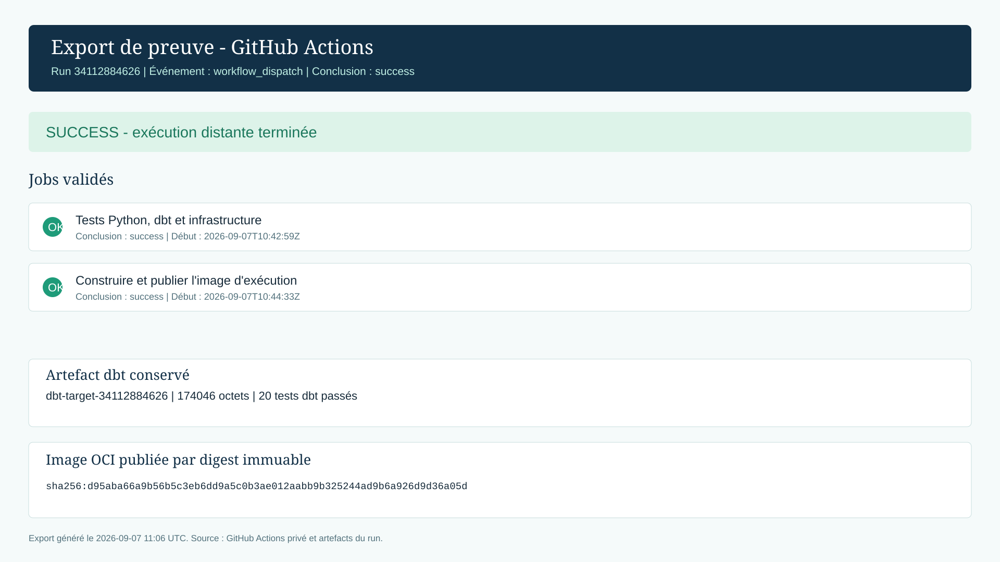

# Preuve CI/CD : GitHub Actions

## I. Exécution distante

Le dépôt privé [MAF1995/coldchain-data-platform](https://github.com/MAF1995/coldchain-data-platform) contient le workflow `Data platform CI-CD`. Une exécution manuelle a été déclenchée le 7 septembre 2026 par l'événement `workflow_dispatch` sur le commit `3a699df0573194ac297f90f4cf4241efe3c4e4e2`.

- Run : [34112884626](https://github.com/MAF1995/coldchain-data-platform/actions/runs/34112884626)
- Conclusion : `success`
- Artefact dbt : `dbt-target-34112884626` (174 046 octets)
- Image OCI : `ghcr.io/maf1995/coldchain-data-platform/pharma-data-runtime@sha256:d95aba66a9b56b5c3eb6dd9a5c0b3ae012aabb9b325244ad9b6a926d9d36a05d`
- Contrôles dbt extraits de l'artefact : `20` résultats `pass`



Cet export est généré à partir du run et de ses artefacts via GitHub CLI. Il complète les captures natives du résumé et des logs, sans les imiter.

## II. Captures à conserver

1. La page de résumé du run montrant les deux jobs verts : `Tests Python, dbt et infrastructure` et `Construire et publier l'image d'exécution`.
2. L'onglet **Artifacts** montrant `dbt-target-34112884626`.
3. Le log de construction contenant le digest OCI ci-dessus.

Les captures sont à enregistrer dans `assets/screenshots/bloc4/` sous les noms `06_github_actions_workflow_dispatch.png`, `07_github_actions_dbt_artifact.png` et `08_github_actions_image_digest.png`.

## III. Commandes de contrôle

```powershell
gh run view 34112884626 --repo MAF1995/coldchain-data-platform
gh run download 34112884626 --repo MAF1995/coldchain-data-platform --name dbt-target-34112884626
```
