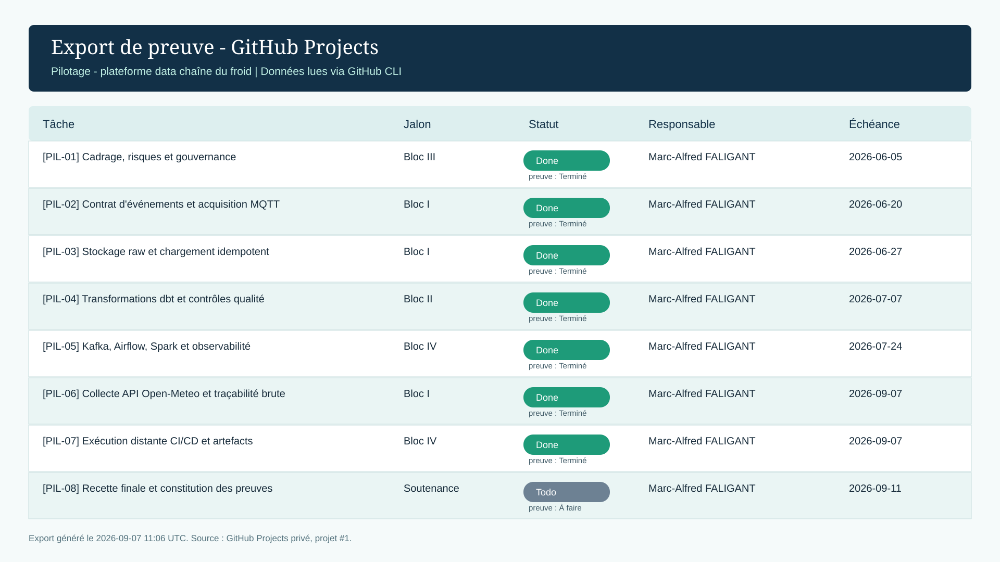

# Preuve de pilotage : GitHub Projects

Le tableau de pilotage est créé dans GitHub Projects, en visibilité privée. Il constitue la preuve de suivi du bloc III : les jalons, le responsable, la date d'échéance et le statut sont visibles sur une seule vue.

## I. Création

Après l'authentification GitHub, exécuter depuis la racine du projet :

```powershell
.\scripts\bootstrap_github_project.ps1 -OpenInBrowser
```

Le script crée ou réutilise le projet **Pilotage - plateforme data chaîne du froid**, le rend privé, puis ajoute les champs suivants :

| Champ | Finalité |
| --- | --- |
| Jalon | Rattacher la tâche au bloc ou à la soutenance. |
| Statut de preuve | Distinguer le travail terminé, en cours et à faire. |
| Responsable | Identifier le pilote de la tâche. |
| Échéance | Rendre le suivi temporel vérifiable. |

## II. État de la preuve

Le projet privé est disponible à l'adresse [github.com/users/MAF1995/projects/1](https://github.com/users/MAF1995/projects/1). Au 7 septembre 2026, `PIL-01` à `PIL-07` sont terminés et `PIL-08` reste planifié pour la recette finale. Chaque ligne possède un jalon, un statut, un responsable et une échéance.



L'export est généré via l'API GitHub Projects authentifiée. Une capture native de la vue **Table** peut le compléter ; elle doit afficher les quatre champs ci-dessus, sans information personnelle inutile.
